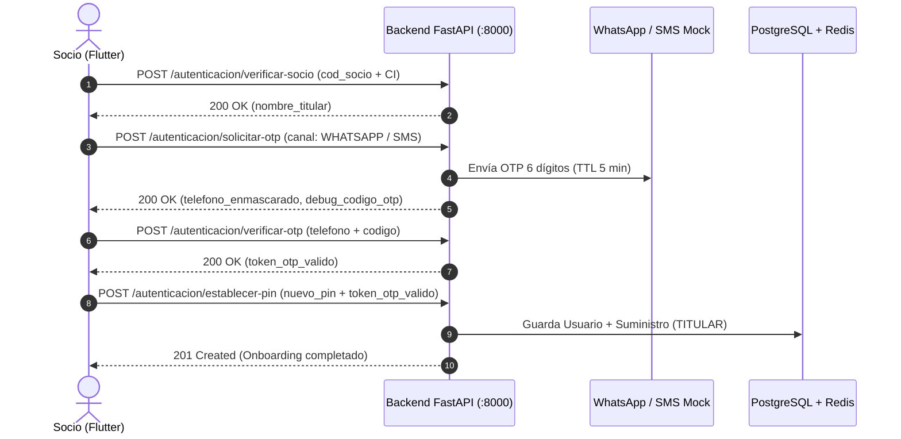

# Guía de Integración Backend para Desarrollador Frontend (Flutter)
> **Proyecto:** App Móvil y Web de Socios COSMOL R.L.  
> **Módulo:** Identidad, Onboarding Dual OTP y Autenticación Multicuenta (Fase 1)  
> **Estado:** 100% Funcional, Probado y Listo para Consumo  
> **URL Base Local:** `http://localhost:8000/api/v1`  
> **Swagger UI Interactivo:** `http://localhost:8000/docs`  
> **ReDoc:** `http://localhost:8000/redoc`  

---

## 1. Conexión de Red para Pruebas (Mobile / Web)

| Plataforma | URL Base | Configuración requerida |
|---|---|---|
| **Móvil Físico (USB)** | `http://localhost:8000/api/v1` | Ejecutar túnel: `adb reverse tcp:8000 tcp:8000` |
| **Android Emulator** | `http://10.0.2.2:8000/api/v1` | IP de loopback estándar del emulador Android |
| **Flutter Web** | `http://localhost:8000/api/v1` | CORS ya configurado para admitir todos los orígenes |

---

## 2. Cuentas de Prueba Pre-cargadas (Sistema Comercial Legado)

Para probar el flujo de Onboarding inicial antes de la integración Informix, se dispone de los siguientes socios habilitados:

| Código Socio (`cod_socio`) | Carnet (`ci`) | Titular Oficial | N° Medidor |
|---|---|---|---|
| **`104523`** | `8392019` | CARLOS EDUARDO PEREZ | `M-50211` |
| **`205566`** | `4920192` | MARIA ELENA ROJAS | `M-88902` |
| **`301144`** | `6102938` | JUAN PABLO SUAREZ | `M-12490` |

---

## 3. Flujo 1: Primer Acceso / Onboarding (Saneamiento de Celular)

Este flujo se ejecuta **una sola vez por socio** para registrar su teléfono verificado y crear su PIN personal.



### Paso 1: Verificar Socio
* **Endpoint:** `POST /api/v1/autenticacion/verificar-socio`
* **Body:**
  ```json
  {
    "cod_socio": "104523",
    "ci": "8392019"
  }
  ```
* **Respuesta Exitosa (`200 OK`):**
  ```json
  {
    "cod_socio": "104523",
    "nombre_titular": "CARLOS EDUARDO PEREZ",
    "mensaje": "Socio verificado correctamente. Proceda a asociar su teléfono celular."
  }
  ```

### Paso 2: Solicitar OTP Dual
* **Endpoint:** `POST /api/v1/autenticacion/solicitar-otp`
* **Body:**
  ```json
  {
    "cod_socio": "104523",
    "telefono": "71029384",
    "canal": "WHATSAPP"
  }
  ```
  *(Nota: `telefono` acepta formato local de 8 dígitos `71029384` o internacional `+59171029384`). `canal` acepta `"WHATSAPP"` o `"SMS"`.*
* **Respuesta Exitosa (`200 OK`):**
  ```json
  {
    "mensaje": "Código de seguridad enviado exitosamente vía WHATSAPP.",
    "canal": "WHATSAPP",
    "telefono_enmascarado": "+591 7***9384",
    "ttl_segundos": 300,
    "debug_codigo_otp": "849201"
  }
  ```
  > **Nota de desarrollo:** En entorno `development`, el campo `debug_codigo_otp` contiene el código generado para facilitar pruebas en Flutter sin necesidad de ver los logs de Docker. En producción este campo es `null`.

### Paso 3: Verificar Código OTP
* **Endpoint:** `POST /api/v1/autenticacion/verificar-otp`
* **Body:**
  ```json
  {
    "telefono": "+59171029384",
    "codigo": "849201"
  }
  ```
* **Respuesta Exitosa (`200 OK`):**
  ```json
  {
    "mensaje": "Número de teléfono verificado exitosamente. Proceda a crear su PIN personal.",
    "token_otp_valido": "kJ829sLw...",
    "cod_socio": "104523"
  }
  ```

### Paso 4: Establecer PIN y Crear Cuenta
* **Endpoint:** `POST /api/v1/autenticacion/establecer-pin`
* **Body:**
  ```json
  {
    "telefono": "+59171029384",
    "token_otp_valido": "kJ829sLw...",
    "nuevo_pin": "4455"
  }
  ```
* **Respuesta Exitosa (`201 Created`):**
  ```json
  {
    "mensaje": "¡Registro completado exitosamente! Ahora puede iniciar sesión con su Código de Socio y su PIN personal.",
    "cod_socio": "104523"
  }
  ```
  *A partir de este instante, la CI queda invalidada como contraseña para siempre.*

---

## 4. Flujo 2: Login Diario Habitual

Una vez completado el Onboarding, el socio inicia sesión diariamente con su Código de Socio y su PIN personal (o Biometría de Flutter).

* **Endpoint:** `POST /api/v1/autenticacion/login`
* **Body:**
  ```json
  {
    "cod_socio": "104523",
    "pin_password": "4455",
    "device_id": "hw-unique-uuid-del-dispositivo",
    "modelo_dispositivo": "Samsung Galaxy A54"
  }
  ```
* **Respuesta Exitosa (`200 OK`):**
  ```json
  {
    "access_token": "eyJhbGciOiJIUzI1NiIs...",
    "refresh_token": "eyJhbGciOiJIUzI1NiIs...",
    "token_type": "bearer",
    "suministros": [
      {
        "id": "550e8400-e29b-41d4-a716-446655440000",
        "cod_socio": "104523",
        "alias": "Mi Casa",
        "rol": "TITULAR",
        "es_suministro_principal": true
      }
    ]
  }
  ```

---

## 5. Flujo 3: Renovación Silenciosa de Token (Refresh Token)

Permite refrescar el `access_token` en segundo plano sin pedir de nuevo las credenciales.

* **Endpoint:** `POST /api/v1/autenticacion/renovar-token`
* **Body:**
  ```json
  {
    "refresh_token": "eyJhbGciOiJIUzI1NiIs...",
    "device_id": "hw-unique-uuid-del-dispositivo"
  }
  ```
* **Respuesta Exitosa (`200 OK`):**
  ```json
  {
    "access_token": "eyJhbGciOiJIUzI1NiIs...",
    "refresh_token": "eyJhbGciOiJIUzI1NiIs...",
    "token_type": "bearer",
    "suministros": []
  }
  ```

---

## 6. Flujo 4: Gestión Multicuenta (Suministros)

Todos estos endpoints requieren enviar la cabecera HTTP:
```http
Authorization: Bearer <access_token>
```

### 6.1 Listar Suministros del Socio
Alimentar el selector desplegable / carrusel del Dashboard principal.
* **Endpoint:** `GET /api/v1/autenticacion/suministros`
* **Cabecera:** `Authorization: Bearer <access_token>`
* **Respuesta Exitosa (`200 OK`):**
  ```json
  [
    {
      "id": "550e8400-e29b-41d4-a716-446655440000",
      "cod_socio": "104523",
      "alias": "Mi Casa",
      "rol": "TITULAR",
      "es_suministro_principal": true
    },
    {
      "id": "789e8400-e29b-41d4-a716-446655440001",
      "cod_socio": "205566",
      "alias": "Alquiler Bolívar",
      "rol": "CONSULTA_PAGO",
      "es_suministro_principal": false
    }
  ]
  ```

### 6.2 Vincular Nuevo Suministro (Titular vs Inquilino)
* **Endpoint:** `POST /api/v1/autenticacion/suministros/vincular`
* **Cabecera:** `Authorization: Bearer <access_token>`
* **Body Modo TITULAR (Requiere CI o Medidor del titular):**
  ```json
  {
    "cod_socio": "205566",
    "ci_o_medidor": "4920192",
    "alias": "Alquiler Bolívar"
  }
  ```
* **Body Modo CONSULTA_PAGO (Inquilino / Pagador externo, sin datos sensibles):**
  ```json
  {
    "cod_socio": "301144",
    "alias": "Departamento Alquiler"
  }
  ```
* **Respuesta Exitosa (`201 Created`):** Retorna el objeto `SuministroResponse` creado.

---

## 7. Códigos de Error y Manejo de Seguridad en Frontend

Todas las respuestas de error del backend siguen el formato estándar:
```json
{
  "success": false,
  "error": {
    "code": "ACCOUNT_LOCKED",
    "message": "Ha alcanzado 3 intentos fallidos consecutivos. Su cuenta ha sido bloqueada temporalmente por 1 minuto(s).",
    "details": {
      "bloqueado_segundos_restantes": 60
    }
  }
}
```

### Tabla de Códigos de Error Críticos para Flutter

| Código de Error | HTTP Status | Acción recomendada en Flutter |
|---|---|---|
| `ACCOUNT_LOCKED` | `403 Forbidden` | Mostrar pantalla modal de cuenta bloqueada con temporizador regressivo usando `details.bloqueado_segundos_restantes`. Ofrecer botón de desbloqueo vía OTP. |
| `SESSION_REVOKED_NEW_DEVICE` | `401 Unauthorized` | Cerrar sesión local inmediatamente y alertar: *"Se inició sesión en otro dispositivo. Su sesión en este equipo fue revocada."* (Estilo WhatsApp). |
| `ONBOARDING_REQUIRED` | `401 Unauthorized` | Redirigir al usuario al flujo de Primer Acceso (paso 1). |
| `OTP_RATE_LIMIT_EXCEEDED` | `403 Forbidden` | Informar al socio que ha superado 3 solicitudes de OTP por hora y debe esperar antes de reintentar. |
| `OTP_INVALID` | `400 Bad Request` | Notificar código erróneo e indicar número de intento (al 3er fallo el código se quema). |
| `OTP_MAX_ATTEMPTS` | `403 Forbidden` | Informar que el código fue invalidado por seguridad y solicitar uno nuevo. |
| `SUMINISTRO_ALREADY_LINKED` | `400 Bad Request` | Notificar que ese contrato ya está en su lista multicuenta. |
