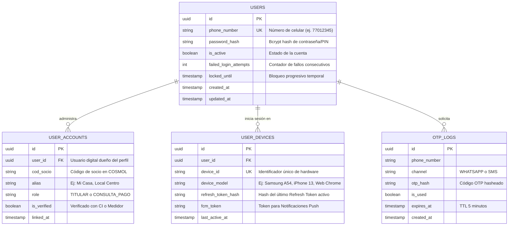
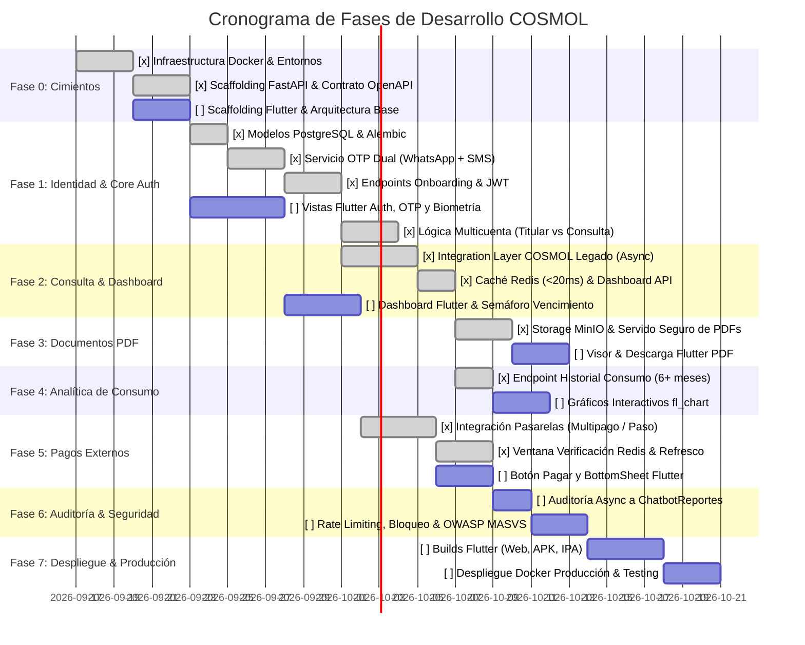

# Hoja de Ruta de Desarrollo y Arquitectura Técnica
## Plataforma Web y Móvil para Asociados — COSMOL R.L.

> **Documento Maestro de Ejecución Técnica**  
> **Ubicación:** `Docs/HOJA_DE_RUTA_DESARROLLO.md`  
> **Basado en:** `AGENTS.md` y `PROPUESTA_AUTENTICACION_Y_SESIONES.md`  
> **Estado:** Aprobado para Ejecución  
> **Fecha:** Septiembre 2026  

---

## 1. Visión General y Principios de Arquitectura

El objetivo es construir una solución omnicanal (Android, iOS y Web) altamente escalable, desacoplada y segura para los asociados de **COSMOL R.L.** en Montero, Bolivia.

### Principios Rectores:
1. **Frontend Desacoplado (BFF - Backend for Frontend):** Flutter interactúa exclusivamente con nuestra API REST en **FastAPI**. Flutter **nunca** conoce la base de datos interna de COSMOL ni sus esquemas legados.
2. **Identidad Digital Independiente:** Separación estricta entre el **Usuario Digital** (persona con celular verificado) y los **Códigos de Socio** (contratos/suministros de agua vinculados con roles de Titular o Consulta/Pago).
3. **Resiliencia y Baja Latencia:** Caché agresiva con **Redis** (<20 ms para deudas e históricos) para proteger los servidores legados de COSMOL contra picos de tráfico.
4. **Seguridad y Cero Exposición:** Terminación TLS estricta en **Caddy** (Caddyfile con HTTPS automático nativo), red interna privada Docker para bases de datos (`PostgreSQL`, `Redis`, `MinIO`), y almacenamiento seguro de credenciales con cifrado de hardware en dispositivos móviles (`flutter_secure_storage`).
5. **Auditoría Externa Unidireccional:** Todo evento sensible (login, bloqueo, descarga, pago) se despacha asíncronamente hacia la base de datos del proyecto **ChatbotReportes** sin degradar el tiempo de respuesta al socio.

---

## 2. Topología de Infraestructura y Contenedores Docker

```
                                  [ INTERNET ]
                                       │
                    ┌──────────────────┴──────────────────┐
                    │      HTTPS (443) / HTTP (80)        │
                    ▼                                     ▼
        [ App Móvil Flutter ]                     [ Navegador Web ]
      (Android / iOS vía API)                    (Build Flutter Web)
                    │                                     │
                    └──────────────────┬──────────────────┘
                                       │
                                       ▼
                        ╔═══════════════════════════════════╗
                        ║        gateway-caddy (Docker)     ║
                        ║   - Terminación SSL / TLS Auto    ║
                        ║   - Reverse Proxy a FastAPI       ║
                        ║   - Servido Estático Flutter Web  ║
                        ╚═════════════════╤═════════════════╝
                                          │ Proxy Pass HTTP :8000
    ╔═════════════════════════════════════╪═════════════════════════════════════╗
    ║ ENTORNO DOCKER (Red estándar en Dev / Red aislada en Producción)          ║
    ║                                     ▼                                     ║
    ║                          ╔═════════════════════╗                          ║
    ║                          ║ backend-api (FastAPI║                          ║
    ║                          ║   Puerto 8000)      ║                          ║
    ║                          ╚═══╤═════════╤═════╤═╝                          ║
    ║       SQL Async (:5432)      │         │     │     S3 API (:9000)         ║
    ║    ┌─────────────────────────┘         │     └────────────────────────┐   ║
    ║    ▼                                   ▼                              ▼   ║
    ║ ╔═══════════════╗            ╔═══════════════╗              ╔═══════════╗ ║
    ║ ║  db-postgres  ║            ║  cache-redis  ║              ║storage-   ║ ║
    ║ ║  (PostgreSQL) ║            ║ (Sesión/Caché)║              ║minio (S3) ║ ║
    ║ ╚═══════════════╝            ╚═══════════════╝              ╚═══════════╝ ║
    ╚═════════════════════════════════════╪═════════════════════════════════════╝
                                          │
                     Salida Saliente (Egress) desde backend-api:
                     ├────► Sistema Legado COSMOL (API/BD Lectura Asíncrona)
                     ├────► BD ChatbotReportes (Solo escritura auditoría)
                     ├────► Meta WhatsApp Cloud API / Gateway SMS (Envío OTP)
                     └────► Pasarelas de Pago Oficiales (Hosted Checkout Multipago y Pago al Paso)
```

---

## 3. Modelo de Datos Propio (PostgreSQL)

Para soportar el saneamiento de datos, multicuenta, control de sesiones y bloqueo:



---

## 4. Estructura del Repositorio

Para un desarrollo limpio y modular, se adopta la siguiente estructura de carpetas:

```text
cosmol-app/
├── .github/
│   └── workflows/              # CI/CD (Tests, Docker builds, Flutter builds)
├── Docs/                       # Documentación viva del proyecto
│   ├── HOJA_DE_RUTA_DESARROLLO.md # [Este archivo maestro]
│   ├── pendiente/              # Historias de usuario / tareas por abordar
│   └── realizado/              # Tareas completadas con bitácora de cambios
├── backend/                    # Proyecto Backend FastAPI (Python 3.12+)
│   ├── app/
│   │   ├── api/v1/             # Endpoints (auth, socio, facturas, pagos)
│   │   ├── core/               # Configuración, variables de entorno, seguridad (JWT, bcrypt)
│   │   ├── db/                 # Conexión SQLAlchemy async, modelos y migraciones Alembic
│   │   ├── integrations/       # Clientes HTTP (COSMOL Legado, WhatsApp API, SMS Gateway)
│   │   ├── schemas/            # Esquemas Pydantic v2 (Request / Response DTOs)
│   │   ├── services/           # Lógica de negocio (AuthService, DebtService, PdfService)
│   │   └── tasks/              # BackgroundTasks (Auditoría hacia ChatbotReportes)
│   ├── tests/                  # Pruebas unitarias y de integración (pytest + httpx)
│   ├── Dockerfile
│   └── requirements.txt
├── frontend/                   # Proyecto Flutter (Móvil Android/iOS + Web)
│   ├── lib/
│   │   ├── core/               # Tema visual COSMOL, router (go_router), clientes HTTP (dio)
│   │   ├── features/           # Módulos por Clean Architecture:
│   │   │   ├── auth/           # Login, Onboarding OTP, PIN, Biometría
│   │   │   ├── multicuenta/    # Selector y vinculación de suministros
│   │   │   ├── dashboard/      # Deuda en Bs, semaforización de vencimiento
│   │   │   ├── documents/      # Historial y visor de facturas/avisos PDF
│   │   │   ├── consumption/    # Gráficos analíticos de consumo (fl_chart)
│   │   │   └── payments/       # Botón "Pagar Ahora", QR interbancario
│   │   └── main.dart
│   ├── test/                   # Tests unitarios y de widgets
│   └── pubspec.yaml
├── docker-compose.yml          # Orquestación de servicios locales / staging
├── docker-compose.prod.yml     # Orquestación para producción
├── caddy/                      # Configuración de Caddy (Caddyfile con HTTPS automático)
└── AGENTS.md                   # Base conceptual y reglas del proyecto
```

---

## 5. Fases de Implementación Secuencial



---

### Detalle de Fases y Entregables Técnicos

---

### **Fase 0: Cimientos de Infraestructura, Entorno Docker y Contratos API**
> **Meta:** Dejar corriendo el ecosistema local completo y definir el contrato OpenAPI sin esperar integraciones legadas.

- [x] **0.1 Orquestación Docker:**
  - Crear `docker-compose.yml` con los contenedores: `backend-api` (FastAPI), `db-postgres` (Postgres 16), `cache-redis` (Redis 7), `storage-minio` (MinIO), y `gateway-caddy` (Caddy v2 con Caddyfile).
  - Configurar red estándar de desarrollo con exposición directa de puertos a `localhost` (Postgres en 5432, Redis en 6379, MinIO en 9000/9001, FastAPI en 8000) y volúmenes persistentes (`postgres_data`, `redis_data`, `minio_data`). La red aislada `cosmol_net` se pospone para producción.
- [x] **0.2 Scaffolding Backend (FastAPI):**
  - Configurar Python 3.12, Uvicorn, Pydantic v2, SQLAlchemy en modo Async con `asyncpg`.
  - Definir estructura de configuración mediante `.env` seguro.
  - Diseñar el contrato de API REST documentado con OpenAPI/Swagger (`/docs`).
- [ ] **0.3 Scaffolding Flutter:**
  - Inicializar proyecto Flutter 3.x con soporte Android, iOS y Web.
  - Configurar estructura Clean Architecture (Data, Domain, Presentation).
  - Configurar gestión de estado (`Riverpod`), enrutamiento declarativo (`go_router`) y cliente de red (`dio` con interceptores para JWT).
  - Implementar paleta institucional de COSMOL (Azul cooperativo, acentos cian, tipografía moderna, semaforización de alertas).

---

### **Fase 1: Identidad, Onboarding Dual OTP y Autenticación Multicuenta (El Core)**
> **Meta:** Resolver la ausencia de teléfonos en la BD legada mediante el flujo de saneamiento y blindaje con contraseña/PIN.

- [x] **1.1 Base de Datos de Identidad (PostgreSQL + Alembic):**
  - Generar migraciones para tablas `users`, `user_accounts`, `user_devices` y `otp_logs`.
- [x] **1.2 Integración de Mensajería OTP Dual:**
  - Integrar cliente HTTP asíncrono para **WhatsApp Cloud API** (reutilizando WABA y número del Chatbot de COSMOL con plantilla de autenticación aprobada).
  - Integrar cliente de fallback para **Gateway SMS**.
  - Almacenar el OTP hasheado en Redis con TTL de 5 minutos y límite de 3 solicitudes por hora por número.
- [x] **1.3 Flujo de Onboarding (Primer Acceso):**
  - Endpoint `POST /api/v1/auth/verify-socio`: Valida `cod_socio + CI` contra el sistema legado.
  - Endpoint `POST /api/v1/auth/request-otp`: Envía el código al celular vía WhatsApp o SMS a elección.
  - Endpoint `POST /api/v1/auth/verify-otp`: Valida el código en Redis.
  - Endpoint `POST /api/v1/auth/set-credentials`: Registra el PIN o contraseña con `passlib[bcrypt]`, activa la cuenta e invalida el uso del CI como contraseña.
- [x] **1.4 Login Diario y Control de Sesiones:**
  - Endpoint `POST /api/v1/auth/login`: Ingreso con `cod_socio` + PIN/Contraseña.
  - Emisión de JWT: `access_token` (15 min) y `refresh_token` (7 días).
  - Modelo de sesión única: al detectar un nuevo `Device ID`, revocar el refresh token del dispositivo previo.
  - Endpoint `POST /api/v1/auth/refresh`: Renovación transparente de tokens.
  - Endpoint `POST /api/v1/auth/recover-password`: Flujo de reseteo mediante OTP.
- [ ] **1.5 UI en Flutter para Autenticación:**
  - Pantallas: Bienvenida, Primer Ingreso (`cod_socio + CI`), Selector de canal OTP (WhatsApp / SMS), Ingreso de código de 6 dígitos con cuenta regresiva, Creación de PIN/Contraseña.
  - Login habitual y soporte para Biometría nativa (`local_auth`: Huella dactilar / Face ID).
- [x] **1.6 Lógica Multicuenta:**
  - Endpoints para asociar códigos de socio adicionales:
    - Modo Titular (valida CI/Medidor).
    - Modo Consulta y Pago (solo valida `cod_socio`; enmascara datos sensibles).
  - Selector desplegable superior en el Dashboard de Flutter con alias (*"Mi Casa"*, *"Alquiler Bolívar"*).

---

### **Fase 2: Integración con Sistema Legado y Dashboard de Deuda (MVP de Consulta)**
> **Meta:** Mostrar al socio su deuda real, fechas y avisos en menos de 20 ms.

- [x] **2.1 Capa de Integración Resiliente (BFF):**
  - Cliente `httpx` async hacia el sistema legado de COSMOL con connection pooling, timeouts estrictos (3s) y manejo de excepciones.
- [x] **2.2 Estrategia de Caché Redis:**
  - Endpoint `GET /api/v1/deuda/{cod_socio}` y `GET /api/v1/deuda/dashboard/resumen`.
  - Revisar Redis (`deuda:{cod_socio}` con TTL de 10 min).
  - Si hay *cache-miss*, consultar sistema legado, normalizar datos a Pydantic, guardar en Redis y retornar.
- [ ] **2.3 Dashboard Principal en Flutter:**
  - Visualización destacada: Saldo pendiente y monto exacto a pagar en moneda boliviana (**Bs**).
  - Semaforización de fecha de vencimiento: Texto normal si está vigente, **color rojo destacado** con advertencia si ya expiró.
  - Soporte de visualización sin conexión (caché local con `hive_flutter` o `isar` mostrando último saldo conocido con marca de tiempo).

---


### **Fase 3: Repositorio Digital de Documentos (PDFs de Facturas y Avisos)**
> **Meta:** Eliminar el gasto de papel permitiendo visualizar y descargar facturas con valor legal y avisos de corte.

- [x] **3.1 Almacenamiento de Objetos en MinIO y Servido Seguro:**
  - Configurar bucket privado `cosmol-docs`.
  - Endpoint `GET /api/v1/documentos/{cod_socio}`: Lista de facturas, avisos de cobranza y avisos de corte disponibles por pestañas con privacidad multicuenta.
  - Endpoint `GET /api/v1/documentos/{doc_id}/descargar`: Valida permisos del usuario (Titular vs Inquilino con bloqueo 403 `DOCUMENT_ACCESS_DENIED`) y transmite el flujo binario PDF por streaming (`StreamingResponse`).
  - Motor institucional ReportLab (`GeneradorPdfDocumento`) y persistencia sincronizada con PostgreSQL (`Documento`).
- [ ] **3.2 Visor y Descarga en Flutter:**
  - Pantalla con pestañas: *Facturas*, *Avisos de Cobranza*, *Avisos de Corte*.
  - Integración de `flutter_pdfview` para previsualización inmediata dentro de la app.
  - Botones de acción: *"Guardar en dispositivo"* (`path_provider` + `open_filex`) y *"Compartir"* vía WhatsApp u otras aplicaciones.

---

### **Fase 4: Analítica de Consumo Histórico**
> **Meta:** Proveer al socio transparencia sobre sus hábitos de consumo mensual en metros cúbicos ($m^3$).

- [x] **4.1 Endpoint de Consumo y Lógica de Negocio (Backend):**
  - Endpoint `GET /api/v1/consumo/{cod_socio}` e invalidación `POST /api/v1/consumo/{cod_socio}/invalidar-cache`.
  - Extracción en vivo desde Informix (`GET /socios/{cod_socio}/historial-facturas`) de los 12 meses históricos (atributo `"CONSUMO"` en $m^3$ y `"MONTO"` en Bs).
  - Estrategia de caché en Redis (`consumo:{cod_socio}`, TTL 15 min, latencia <20 ms).
  - Cálculo estadístico (promedios, máximos/mínimos, tendencia) y alerta de fuga preventiva (`consumo_atipico = True` si $\ge +30\%$).
  - Control multicuenta: enmascaramiento de datos sensibles para inquilinos (`CONSULTA_PAGO`).
  - Suite de pruebas de Fase 4 integrada con **90/90 tests aprobados al 100% en Docker** (cero mocks).
- [ ] **4.2 Gráficos en Flutter:**
  - Implementación de gráficos de barras o líneas con `fl_chart`.
  - Ejes definidos: Meses vs. Volumen consumido ($m^3$).
  - Tooltips interactivos al pulsar sobre cada mes (muestra lectura anterior, lectura actual y fecha).
  - Detección de consumos atípicos (aviso visual si el consumo superó el 30% del promedio habitual).

---

### **Fase 5: Redirección a Pasarelas de Pago Oficiales y Conciliación Dinámica**
> **Meta:** Facilitar el pago inmediato cerrando el ciclo de recaudación mediante Hosted Checkout oficial de COSMOL (Multipago Bolivia y Pago al Paso 24/7) sin procesamiento de tarjetas local ni webhooks entrantes.

- [x] **5.1 Catálogo Oficial y Redirección Hosted Checkout (Backend FastAPI):**
  - Endpoint `GET /api/v1/pagos/canales/{cod_socio}`: Retorna canales oficiales con monto exacto en Bs y URLs de recaudación configuradas.
  - Endpoint `POST /api/v1/pagos/registrar-intento/{cod_socio}`: Registra la intención, guarda auditoría en PostgreSQL (`auditoria_pagos_redireccion`) y activa la ventana de verificación en Redis.
  - Endpoint `GET /api/v1/pagos/verificar-estado/{cod_socio}`: Consulta en vivo si la deuda fue saldada.
- [x] **5.2 Ventana Inteligente de Verificación y Refresco Dinámico (Sin Webhooks):**
  - Al no existir webhooks entrantes en la arquitectura de COSMOL (las pasarelas liquidan directamente B2B en Informix central), se implementa la **Ventana Inteligente de Verificación** en Redis con clave `pago_en_proceso:{cod_socio}` (TTL 15 min, `NX=True`) y purga de caché de deuda vieja.
  - Endpoint `GET /api/v1/deuda/{cod_socio}?forzar_refresco=true`: Detecta automáticamente la ventana activa y aplica un micro-TTL de 30s (cooldown anti-saturación de Informix) para reflejar inmediatamente el saldo Bs 0.00 cuando el socio regresa a la app.
- [ ] **5.3 Experiencia de Usuario en Flutter (Frontend):**
  - Botón principal *"Pagar Ahora"* en el Dashboard que consume el catálogo y despliega un *BottomSheet*.
  - Al seleccionar un canal, consume `registrar-intento` y abre la pasarela externa usando `url_launcher`.
  - Pull-to-refresh en el Dashboard con `forzar_refresco=true` para actualizar el saldo en tiempo real tras pagar.

---

### **Fase 6: Auditoría a COSMOL-Reportes, Rate Limiting y Seguridad Avanzada**
> **Meta:** Cumplir con las políticas de auditoría corporativa y blindar la app contra ataques.

- [ ] **6.1 Despacho de Auditoría Asíncrono hacia `COSMOL-Reportes`:**
  - Integración desacoplada vía REST API consumiendo `POST {REPORTES_API_URL}/api/consultas` con header `X-Reportes-Token`.
  - Despacho en segundo plano (`BackgroundTasks` de FastAPI) con 0 ms de impacto en la latencia del socio.
  - Identificación del canal: **`id_usuario = 3`** (App de Socios) y **`tipo_ubicacion = 'APP_MOVIL'`** para distinguirse del Chatbot (`id_usuario = 2`).
  - Eventos despachados:
    - `id_tipo = 1`: `Autenticación / Acceso` (Login diario y Onboarding).
    - `id_tipo = 2`: `Consulta de Deuda` (Dashboard principal).
    - `id_tipo = 3`: `Historial de Facturas` (Consumos de 12 meses).
    - `id_tipo = 9`: `Descarga de Documento PDF` (Facturas oficiales y avisos).
    - `id_tipo = 10`: `Intento de Pago Pasarela` (Multipago / Pago al Paso).
  - Documentos de soporte: `Docs/backend/pendiente/TASK-06-auditoria-reportes.md` y `Docs/reportes/GUIA_VISTA_APP_SOCIOS_COSMOL_REPORTES.md`.
- [ ] **6.2 Política de Bloqueo por Intentos Fallidos:**
  - Implementar `slowapi` en FastAPI para rate limiting por IP (previene ataques distribuidos).
  - Bloqueo progresivo por cuenta tras **3 intentos fallidos consecutivos**:
    - Intento 3 fallido: Bloqueo de 1 min.
    - Intento 4 fallido: Bloqueo de 5 min.
    - Intento 5 fallido: Bloqueo de 15 min.
    - Intentos posteriores: Bloqueo de 1 hora.
  - Opción de desbloqueo inmediato completando el flujo de verificación OTP al celular registrado.
- [ ] **6.3 Revisión de Seguridad OWASP MASVS:**
  - Verificación de que no existan secretos ni contraseñas en código fuente.
  - Habilitar Certificate Pinning / validación estricta de TLS en el cliente `dio`.
  - Ofuscación de código en compilación de producción (`--obfuscate --split-debug-info`).

---

### **Fase 7: Automatización CI/CD, Despliegue en Producción y Publicación Omnicanal**
> **Meta:** Poner la plataforma en manos de los socios de Montero con despliegue automatizado.

- [ ] **7.1 Pipelines de GitHub Actions:**
  - Linting y tests automatizados de backend (`pytest`) y frontend (`flutter test`).
  - Construcción de imágenes Docker multi-etapa para `backend-api` y `gateway-caddy`.
- [ ] **7.2 Despliegue del Backend:**
  - Despliegue en servidor de producción con `docker-compose.prod.yml`.
  - Configuración de certificados SSL/TLS automáticos con Let's Encrypt / ZeroSSL nativo en Caddy.
  - Configuración de backups automatizados de PostgreSQL y MinIO.
- [ ] **7.3 Despliegue Flutter Web:**
  - Generación de build optimizado (`flutter build web --release`).
  - Servido a través de Caddy (`file_server`) bajo la ruta web oficial de COSMOL.
- [ ] **7.4 Publicación de Apps Móviles:**
  - **Android:** Generación de App Bundle firmado (`.aab`) y carga en Google Play Console (Track de pruebas cerradas → Producción).
  - **iOS:** Carga a TestFlight para pruebas beta internas y posterior envío a revisión en App Store Connect.

---

## 6. Entorno de Pruebas y Estrategia de Validación en Hardware Real

### 6.1 Pruebas Móviles en Teléfono Físico vía Cable USB
Para garantizar que la experiencia de usuario, el rendimiento y la seguridad sean idénticos al uso real de los socios de Montero:
- **Dispositivo de Pruebas:** Las pruebas y depuración se realizarán directamente en un **teléfono móvil Android físico conectado por cable USB** (con *Depuración por USB* activa), **descartando el uso de emuladores de Android Studio**.
- **Requisitos en el Equipo de Desarrollo:** Se utiliza el **Android SDK** ya instalado localmente en la máquina de desarrollo (`adb`).
- **Ventajas de Probar en Dispositivo Físico:**
  - Validación precisa de la autenticación biométrica (`local_auth`: lector de huella físico real).
  - Validación del escaneo y renderizado de códigos QR en pantalla real.
  - Comprobación real de rendimiento, transiciones y consumo de batería.
- **Túnel de Conexión Móvil ↔ Docker Backend:**
  - Para que el teléfono conectado por USB pueda comunicarse con la API de FastAPI corriendo dentro de Docker en la PC sin lidiar con firewalls o IPs cambiantes de Wi-Fi, se utilizará el comando de redirección de puertos de Android Debug Bridge:
    ```bash
    adb reverse tcp:8000 tcp:8000
    ```
  - Con esto, las peticiones que haga la app Flutter a `http://localhost:8000/api/v1` desde el teléfono físico viajarán transparentemente a través del cable USB directo al contenedor `backend-api` de Docker.

### 6.2 Pruebas en Web (Flutter Web)
- *Nota de alcance:* El procedimiento, entorno y estrategia de pruebas específicas para la versión **Flutter Web** se explicarán y documentarán en detalle en una etapa posterior, una vez consolidado el flujo móvil en hardware real.

---

## 7. Sistema de Seguimiento de Tareas (`Docs/pendiente` y `Docs/realizado`)

Para mantener una gobernanza limpia del avance durante el desarrollo:

1. **Tareas por iniciar o en curso:** Se crearán como archivos de especificación en `Docs/pendiente/` (ej: `TASK-01-scaffolding-backend.md`, `TASK-02-auth-otp.md`).
2. **Tareas concluidas:** Una vez implementadas y probadas con éxito, se moverán a `Docs/realizado/` con la fecha de cierre, los archivos modificados y las pruebas de validación ejecutadas.

---

## 7. Matriz de Riesgos Técnicos y Estrategias de Mitigación

| Riesgo Técnico | Impacto | Probabilidad | Estrategia de Mitigación |
|---|---|---|---|
| **Caída o lentitud de la BD Legada de COSMOL** | Crítico | Media | Caché Redis con TTL de 10 min y circuit breaker en FastAPI. El usuario verá el último saldo consultado en vez de un error de timeout. |
| **Demora o fallo en entrega de SMS** | Alto | Media | Priorizar **WhatsApp Cloud API** como canal predeterminado (tasa de entrega >98% en segundos). Ofrecer reenvío con contador de 60 segundos. |
| **Pérdida de conectividad móvil en el socio** | Medio | Alta | Almacenamiento local seguro en Flutter (`hive_flutter`). El socio puede abrir la app y ver su aviso/factura descargada previamente sin tener señal. |
| **Ataques de fuerza bruta a contraseñas o OTP** | Crítico | Media | Bloqueo estricto tras 3 intentos fallidos, rate limit por IP con `slowapi`, y máximo 3 solicitudes de OTP por hora por número. |
| **Desfase en la actualización de saldo tras un pago** | Alto | Media | La ventana inteligente de Redis purga la caché de deuda e impone un micro-TTL de 30s para consultar directamente a Informix al hacer pull-to-refresh o refresco manual, sin depender de webhooks externos. |

---

## 8. Siguientes Pasos Inmediatos

1. Iniciar la **Fase 0**:
   - Crear el archivo `docker-compose.yml` base y la estructura de carpetas `backend/` y `frontend/`.
   - Inicializar el entorno FastAPI y configurar el modelo de red interna de Docker.
2. Crear la primera tarea en `Docs/pendiente/TASK-00-entorno-e-infraestructura.md`.
