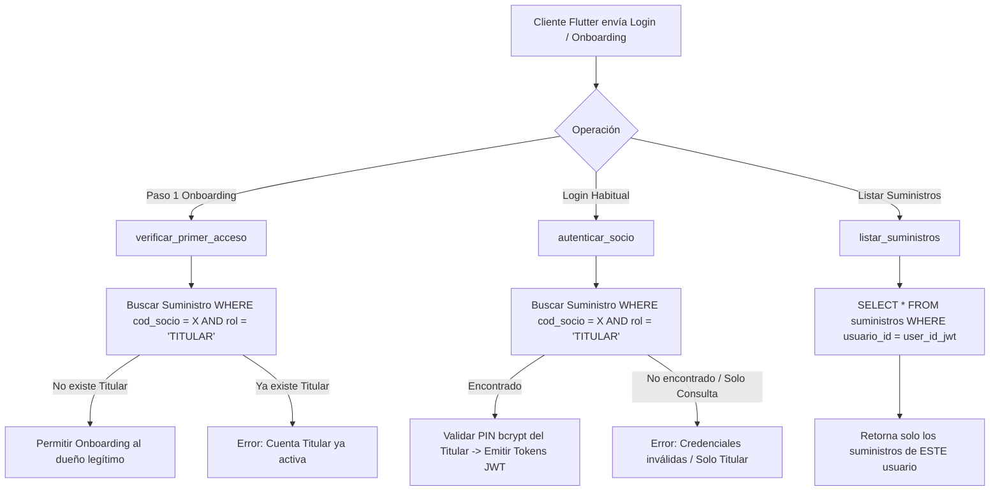

# Plan de Implementación: Lógica de Negocio Multicuenta y Login Exclusivo Titular
> **Módulo:** Autenticación e Identidad / Multicuenta (`backend/app/services/servicio_autenticacion.py`, `servicio_suministros.py`)  
> **Proyecto:** COSMOL RL — Plataforma Web y Móvil  
> **Fecha:** Octubre 2026  
> **Ubicación:** `Docs/backend/guias/PLAN_LOGICA_MULTICUENTA_Y_LOGIN_TITULAR.md`  
> **Estado:** Documento de Definición y Plan de Ejecución Backend

---

## 1. Respuesta a la Duda de Negocio: Privacidad y Aislamiento Multicuenta

### 1.1 Escenario Planteado:
> *Si Juan registra su cuenta y agrega como INQUILINO la cuenta de José, Juan verá las 2 cuentas en su app. Si José luego registra su propia cuenta en otro teléfono en modo TITULAR, ¿le debería aparecer a José la cuenta de Juan?*

### 1.2 Regla de Oro de Seguridad y Privacidad:
> 🚫 **NO. Bajo ninguna circunstancia José debe ver la cuenta de Juan.**

La vinculación de suministros es **estrictamente privada, unidireccional y aislada por Usuario Digital (`usuario_id`)**:

```
┌──────────────────────────────────────────────────────────────────────────────────┐
│                   ESTRUCTURA DE DATOS EN BD (POSTGRESQL)                         │
├──────────────────────────────────────────────────────────────────────────────────┤
│ USUARIO A (Juan - Tel: 71000001):                                                │
│  ├─ Suministro 1001 (Casa de Juan)  -> Rol: TITULAR (Principal)                  │
│  └─ Suministro 2002 (Alquiler José) -> Rol: CONSULTA_PAGO (Secundario)           │
│                                                                                  │
│ USUARIO B (José - Tel: 72000002):                                                │
│  └─ Suministro 2002 (Casa de José)  -> Rol: TITULAR (Principal)                  │
└──────────────────────────────────────────────────────────────────────────────────┘
```

* **Qué ve Juan en su app:** Ve `1001` (su casa) y `2002` (su alquiler agregado para pagar).
* **Qué ve José en su app:** Ve **únicamente** `2002` (su casa propia).
* **Por qué:** Porque cada consulta a la base de datos filtra por `WHERE suministros.usuario_id = :usuario_autenticado_id`. José nunca tiene relación alguna con el suministro `1001` de Juan.

---

## 2. Puntos Críticos Detectados y Ajustes en Backend

Para que este modelo funcione a la perfección sin colisiones, debemos ajustar 3 validaciones en el backend:

---

### 2.1 Ajuste 1: Login Diario Exclusivo con Código TITULAR
* **Problema actual:** Si Juan agregó `2002` como consulta, y José es el titular de `2002`, existen 2 filas con `cod_socio = '2002'` en la tabla `suministros`. Una consulta sin filtro de rol podría traer arbitrariamente a Juan o a José.
* **Regla de Negocio:** El inicio de sesión habitual (`POST /api/v1/auth/login`) debe autenticar **única y exclusivamente** al socio que posee el rol **`TITULAR`** sobre ese código.
* **Solución Técnica (`servicio_autenticacion.py`):**
  ```python
  # Filtrar estrictamente por rol TITULAR en el login
  stmt_sum = (
      select(Suministro)
      .where(
          Suministro.cod_socio == cod_socio,
          Suministro.rol == "TITULAR"
      )
  )
  ```
  * Si alguien intenta iniciar sesión con un código que solo existe como `CONSULTA_PAGO`, el backend responderá con `UNAUTHORIZED` (`INVALID_CREDENTIALS` o `"Debe iniciar sesión con su código de socio titular"`).

---

### 2.2 Ajuste 2: Onboarding de Titulares sin Bloqueo por Inquilinos Previos
* **Problema actual:** En `verificar_primer_acceso` (Paso 1 del Onboarding), se verificaba si el `cod_socio` ya existía en la tabla `suministros`. Si Juan había agregado a José (`2002`) como inquilino una semana antes, cuando José quería crearse su cuenta legítima, el sistema le decía erróneamente: *"Este socio ya tiene una cuenta activa"*.
* **Solución Técnica (`servicio_autenticacion.py`):**
  ```python
  # Solo bloquear si ya existe un usuario registrado como TITULAR
  stmt = (
      select(Suministro)
      .where(
          Suministro.cod_socio == cod_socio,
          Suministro.rol == "TITULAR"
      )
  )
  ```
  * Si solo existía como `CONSULTA_PAGO` vinculado a otros inquilinos, a José se le permite completar su Onboarding como **TITULAR** con su propio celular y PIN.

---

### 2.3 Ajuste 3: Consulta y Listado de Suministros por `user_id`
* **En `servicio_suministros.py`:**
  * Al listar (`GET /api/v1/autenticacion/suministros`) y vincular (`POST /api/v1/autenticacion/suministros/vincular`), se debe utilizar directamente el `usuario_id` (proveniente del `sub` del token JWT).
  * Esto garantiza que un usuario **únicamente** reciba los suministros que le pertenecen a su propio `usuario_id`.

---

## 3. Plan de Modificaciones en el Código Backend



---

## 4. Tareas Concretas a Ejecutar en Backend

1. **`backend/app/services/servicio_autenticacion.py`:**
   * En `verificar_primer_acceso(cod_socio, ci)`: Añadir condición `Suministro.rol == "TITULAR"`.
   * En `autenticar_socio(cod_socio, pin_password, ...)`: Filtrar `Suministro.cod_socio == cod_socio` con `Suministro.rol == "TITULAR"`.
2. **`backend/app/services/servicio_suministros.py`:**
   * En `listar_suministros`: Extraer y filtrar por `usuario_id` de forma determinista.
   * En `vincular_suministro`: Mantener el control de unicidad (`uq_usuario_cod_socio`) para no vincular dos veces el mismo código a un mismo usuario.
3. **`backend/tests/`:**
   * Crear test automatizado simulando el caso Juan y José para certificar que:
     - Juan agrega a José como consulta.
     - José hace onboarding como titular exitosamente.
     - José hace login y solo ve su propia cuenta.
     - Juan hace login y ve su cuenta y la de consulta.
     - Ninguno de los dos ve información privada del otro.

---

## 5. Resumen Ejecutivo
* La relación multicuenta es **privada y unidireccional**.
* Ningún socio puede ver quién lo agregó como inquilino ni qué otras cuentas tienen agregadas terceras personas.
* El login en la app queda blindado para aceptar **únicamente códigos de socio titulares**.
