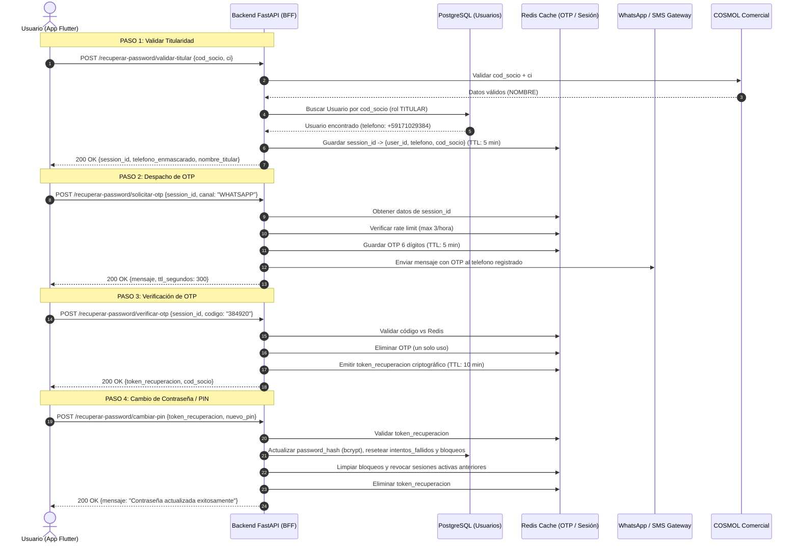

# Plan de Implementación Backend: Recuperación Segura de Contraseña / PIN
> **Módulo:** Autenticación e Identidad (`features/auth` / `app/api/v1/autenticacion.py`)  
> **Proyecto:** COSMOL RL — Plataforma Web y Móvil  
> **Fecha:** Octubre 2026  
> **Ubicación:** `Docs/backend/guias/PLAN_RECUPERACION_PASSWORD_BACKEND.md`  
> **Alcance:** Exclusivamente Backend FastAPI (Contratos finales de integración para el Frontend)

---

## 1. Modelo de Amenazas y Prevención de Suplantación (Anti-Hijacking)

### 1.1 El Problema de Seguridad con Facturas Físicas
En los servicios públicos de agua potable en Bolivia, las facturas impresas o avisos de cobranza suelen ser accesibles a terceros (inquilinos, transeúntes, personal de cobranza). Cualquier persona que encuentre una factura física tiene a la vista:
* Código de Socio (`cod_socio`).
* Nombre del Titular.
* Carnet de Identidad o NIT (`ci`).

### 1.2 Por qué un formulario tradicional es vulnerable
Si el flujo de recuperación de contraseña permitiese que el usuario escriba libremente un número de teléfono celular nuevo en el formulario para recibir el código OTP:
> ❌ **Escenario de Ataque:** Un atacante con una factura ajena ingresaría el `cod_socio` y la `CI` de la factura, colocaría **su propio celular**, recibiría el OTP de 6 dígitos, reestablecería el PIN y se apoderaría de la cuenta del titular.

### 1.3 La Solución Arquitectónica COSMOL (Zero-Trust Phone Binding)
Para garantizar **seguridad bancaria / financiera** y evitar secuestro de cuentas:

```
┌──────────────────────────────────────────────────────────────────────────────────┐
│                             FLUJO ZERO-TRUST COSMOL                              │
├──────────────────────────────────────────────────────────────────────────────────┤
│ 1. El usuario ingresa ÚNICAMENTE: cod_socio + CI en la app.                      │
│ 2. El backend valida contra COSMOL comercial Y consulta en PostgreSQL la cuenta   │
│    del usuario legítimo (Usuario.telefono registrado en Onboarding).             │
│ 3. El usuario NUNCA ingresa el celular. El backend despacha el OTP estrictamente │
│    al número PREVIAMENTE REGISTRADO en la base de datos.                         │
│ 4. El frontend solo recibe el número enmascarado (+591 7*** **384) para feedback. │
│ 5. Solo quien tenga posesión física de la línea celular del socio podrá recibir  │
│    el código OTP de 6 dígitos y continuar con el restablecimiento.               │
└──────────────────────────────────────────────────────────────────────────────────┘
```

---

## 2. Diagrama de Secuencia del Proceso



---

## 3. Especificación Técnica de Endpoints (Contratos API REST)

Prefijo Base: `/api/v1/auth`

---

### 3.1 Paso 1: Validar Titularidad
* **Ruta:** `POST /api/v1/auth/recuperar-password/validar-titular`
* **Autenticación requerida:** Ninguna (Pública).
* **Descripción:** Valida la coincidencia del código de socio y CI contra COSMOL comercial, y verifica que el socio posea una cuenta activa registrada en el sistema.

#### Request Payload (`application/json`):
```json
{
  "cod_socio": "104523",
  "ci": "8392019"
}
```

| Campo | Tipo | Requerido | Descripción / Validación |
|---|---|---|---|
| `cod_socio` | `string` | Sí | Código de socio oficial (3 a 20 caracteres). |
| `ci` | `string` | Sí | Cédula de Identidad del titular (4 a 20 caracteres). |

#### Response 200 OK (`application/json`):
```json
{
  "session_id": "rec_f47ac10b-58cc-4372-a567-0e02b2c3d479",
  "cod_socio": "104523",
  "nombre_titular": "JUAN PEREZ ROCHA",
  "telefono_enmascarado": "+591 7*** **384",
  "mensaje": "Titular validado correctamente. Seleccione el canal para recibir su código de seguridad."
}
```

#### Errores Posibles:
* `401 UNAUTHORIZED` (`SOCIO_NOT_FOUND`): El código de socio o carnet de identidad no coinciden en COSMOL.
* `404 NOT_FOUND` (`ACCOUNT_NOT_REGISTERED`): Este socio no tiene una cuenta registrada en la aplicación. Debe realizar su registro inicial (Onboarding).
* `401 UNAUTHORIZED` (`ACCOUNT_DISABLED`): La cuenta del socio se encuentra inactiva o dada de baja.

---

### 3.2 Paso 2: Solicitar Despacho de OTP
* **Ruta:** `POST /api/v1/auth/recuperar-password/solicitar-otp`
* **Autenticación requerida:** Ninguna.
* **Descripción:** Genera un código OTP de 6 dígitos con vigencia de 5 minutos y lo envía al número registrado en la cuenta.

#### Request Payload (`application/json`):
```json
{
  "session_id": "rec_f47ac10b-58cc-4372-a567-0e02b2c3d479",
  "canal": "WHATSAPP"
}
```

| Campo | Tipo | Requerido | Descripción / Validación |
|---|---|---|---|
| `session_id` | `string` | Sí | Identificador de sesión obtenido en el Paso 1. |
| `canal` | `string` | No (Default: `"WHATSAPP"`) | Canal de entrega: `"WHATSAPP"` o `"SMS"`. |

#### Response 200 OK (`application/json`):
```json
{
  "mensaje": "Código de seguridad enviado exitosamente vía WHATSAPP.",
  "canal": "WHATSAPP",
  "telefono_enmascarado": "+591 7*** **384",
  "ttl_segundos": 300,
  "debug_codigo_otp": "384920"
}
```
> [!NOTE]
> `debug_codigo_otp` únicamente se envía cuando la variable de entorno `ENVIRONMENT="development"`. En producción es `null`.

#### Errores Posibles:
* `400 BAD_REQUEST` (`RECOVERY_SESSION_EXPIRED`): La sesión de recuperación ha expirado. Debe reiniciar el proceso.
* `403 FORBIDDEN` (`OTP_RATE_LIMIT_EXCEEDED`): Ha superado el límite de 3 solicitudes de OTP por hora.

---

### 3.3 Paso 3: Validar Código OTP
* **Ruta:** `POST /api/v1/auth/recuperar-password/verificar-otp`
* **Autenticación requerida:** Ninguna.
* **Descripción:** Valida el código de 6 dígitos ingresado por el usuario. Al acertar, destruye el OTP y emite un token de autorización temporal para cambiar la contraseña.

#### Request Payload (`application/json`):
```json
{
  "session_id": "rec_f47ac10b-58cc-4372-a567-0e02b2c3d479",
  "codigo": "384920"
}
```

| Campo | Tipo | Requerido | Descripción / Validación |
|---|---|---|---|
| `session_id` | `string` | Sí | Identificador de sesión de recuperación. |
| `codigo` | `string` | Sí | Código numérico de exactamente 6 dígitos. |

#### Response 200 OK (`application/json`):
```json
{
  "mensaje": "Código verificado exitosamente. Proceda a definir su nueva contraseña.",
  "token_recuperacion": "rst_a1b2c3d4e5f67890abcdef1234567890abcdef12",
  "cod_socio": "104523"
}
```

#### Errores Posibles:
* `400 BAD_REQUEST` (`OTP_EXPIRED`): El código de seguridad ha expirado o no fue solicitado.
* `400 BAD_REQUEST` (`OTP_INVALID`): Código de seguridad incorrecto. Intento X de 3.
* `403 FORBIDDEN` (`OTP_MAX_ATTEMPTS`): Demasiados intentos erróneos. El código y la sesión han sido cancelados.

---

### 3.4 Paso 4: Cambiar PIN / Contraseña
* **Ruta:** `POST /api/v1/auth/recuperar-password/cambiar-pin`
* **Autenticación requerida:** Ninguna (Se valida mediante `token_recuperacion`).
* **Descripción:** Actualiza el hash bcrypt del PIN en PostgreSQL, remueve contadores de bloqueo, revoca sesiones previas en otros dispositivos y finaliza el flujo.

#### Request Payload (`application/json`):
```json
{
  "token_recuperacion": "rst_a1b2c3d4e5f67890abcdef1234567890abcdef12",
  "nuevo_pin": "1234"
}
```

| Campo | Tipo | Requerido | Descripción / Validación |
|---|---|---|---|
| `token_recuperacion` | `string` | Sí | Token temporal criptográfico emitido tras validar el OTP. |
| `nuevo_pin` | `string` | Sí | Nueva clave o PIN personal (mínimo 4 caracteres). |

#### Response 200 OK (`application/json`):
```json
{
  "mensaje": "¡Su contraseña ha sido actualizada exitosamente! Ya puede iniciar sesión con su nuevo PIN.",
  "cod_socio": "104523"
}
```

#### Errores Posibles:
* `401 UNAUTHORIZED` (`INVALID_RECOVERY_TOKEN`): El pase de recuperación es inválido o ha expirado (TTL 10 min).
* `400 BAD_REQUEST` (`VALIDATION_ERROR`): El PIN no cumple con la longitud mínima requerida.

---

## 4. Estructura de Claves y TTLs en Redis

| Clave Redis | Tipo | TTL | Contenido / Propósito |
|---|---|---|---|
| `recuperacion_sesion:{session_id}` | String (JSON) | 300 s (5 min) | `{ "user_id": UUID, "telefono": "+591...", "cod_socio": "..." }` |
| `otp_recuperacion:{session_id}` | String | 300 s (5 min) | `"{codigo_6_digitos}"` |
| `otp_recuperacion_fallos:{session_id}` | Integer | 300 s (5 min) | Contador de intentos fallidos de OTP (Max 3). |
| `rate_otp_recuperacion:{telefono}` | Integer | 3600 s (1 hora) | Control de tasa de envío de SMS/WhatsApp (Max 3/hora). |
| `token_recuperacion_valido:{token}` | String (JSON) | 600 s (10 min) | `{ "user_id": UUID, "telefono": "+591...", "cod_socio": "..." }` |

---

## 5. Implementación en el Backend (Archivos y Tareas)

### 5.1 En `backend/app/schemas/usuario.py`
Definir los esquemas Pydantic v2:
* `RecuperarValidarTitularRequest` / `RecuperarValidarTitularResponse`
* `RecuperarSolicitarOtpRequest` / `RecuperarSolicitarOtpResponse`
* `RecuperarVerificarOtpRequest` / `RecuperarVerificarOtpResponse`
* `RecuperarCambiarPinRequest` / `RecuperarCambiarPinResponse`

### 5.2 En `backend/app/services/servicio_autenticacion.py`
Implementar los 4 métodos de negocio:
1. `validar_titular_recuperacion(cod_socio: str, ci: str)`
2. `solicitar_otp_recuperacion(session_id: str, canal: str)`
3. `verificar_otp_recuperacion(session_id: str, codigo: str)`
4. `cambiar_pin_recuperacion(token_recuperacion: str, nuevo_pin: str)`

### 5.3 En `backend/app/api/v1/autenticacion.py`
Exponer las 4 rutas REST bajo `/api/v1/auth/recuperar-password/*` e inyectar `BackgroundTasks` para auditoría asíncrona hacia `ChatbotReportes`.

### 5.4 En `backend/tests/test_recuperar_password.py`
Añadir suite de tests automatizados con `pytest` que valide:
- Intento con datos inexistentes o CI incorrecta.
- Validación exitosa y retorno de teléfono enmascarado.
- Envío y validación de OTP con generación de `token_recuperacion`.
- Restablecimiento de contraseña y posterior login exitoso con el nuevo PIN.
- Verificación de que intentos fallidos y bloqueos de cuenta quedan reseteados a 0.

---

## 6. Resumen de Nombres de Variables para el Frontend (Dart / Flutter)

Para asegurar que al fusionar los desarrollos no existan discrepancias en los nombres de campos JSON:

```dart
// Paso 1: Validar Titular
class ValidarTitularRequest {
  final String codSocio;      // JSON: "cod_socio"
  final String ci;            // JSON: "ci"
}

class ValidarTitularResponse {
  final String sessionId;           // JSON: "session_id"
  final String codSocio;            // JSON: "cod_socio"
  final String nombreTitular;       // JSON: "nombre_titular"
  final String telefonoEnmascarado; // JSON: "telefono_enmascarado"
  final String mensaje;             // JSON: "mensaje"
}

// Paso 2: Solicitar OTP
class SolicitarOtpRecuperacionRequest {
  final String sessionId;     // JSON: "session_id"
  final String canal;         // JSON: "canal" ("WHATSAPP" | "SMS")
}

// Paso 3: Verificar OTP
class VerificarOtpRecuperacionRequest {
  final String sessionId;     // JSON: "session_id"
  final String codigo;        // JSON: "codigo" (6 dígitos)
}

class VerificarOtpRecuperacionResponse {
  final String tokenRecuperacion; // JSON: "token_recuperacion"
  final String codSocio;          // JSON: "cod_socio"
  final String mensaje;           // JSON: "mensaje"
}

// Paso 4: Cambiar PIN
class CambiarPinRecuperacionRequest {
  final String tokenRecuperacion; // JSON: "token_recuperacion"
  final String nuevoPin;          // JSON: "nuevo_pin"
}
```

---

## 7. Garantías de Integridad y Cierre de Sesión

1. **Hash con Salt Único (Bcrypt):** Ninguna contraseña se almacena en texto claro.
2. **Revocación de Dispositivos Previos:** Cuando se ejecuta `POST /cambiar-pin`, el backend elimina `sesion_activa:{user_id}`, lo que provocará que cualquier atacante o dispositivo anterior sea expulsado automáticamente con `SESSION_REVOKED_NEW_DEVICE` en su siguiente intento de refresco.
3. **Desbloqueo Inmediato:** Si el usuario legítimo tenía su cuenta bloqueada por intentos fallidos de un tercero, completar este flujo de recuperación mediante OTP restablece inmediatamente el estado a desbloqueado (`intentos_fallidos = 0` y `bloqueado_hasta = None`).
