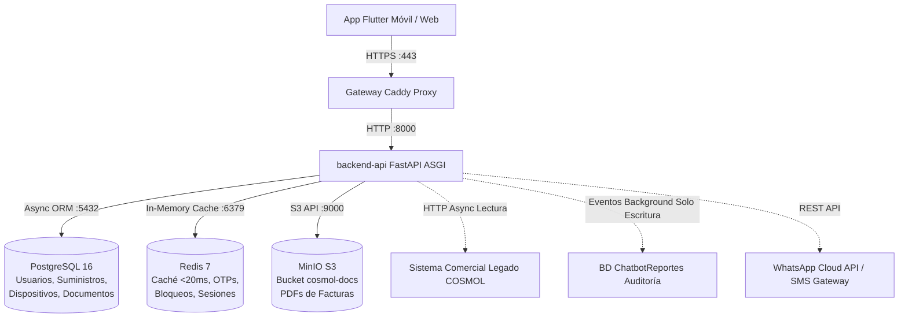
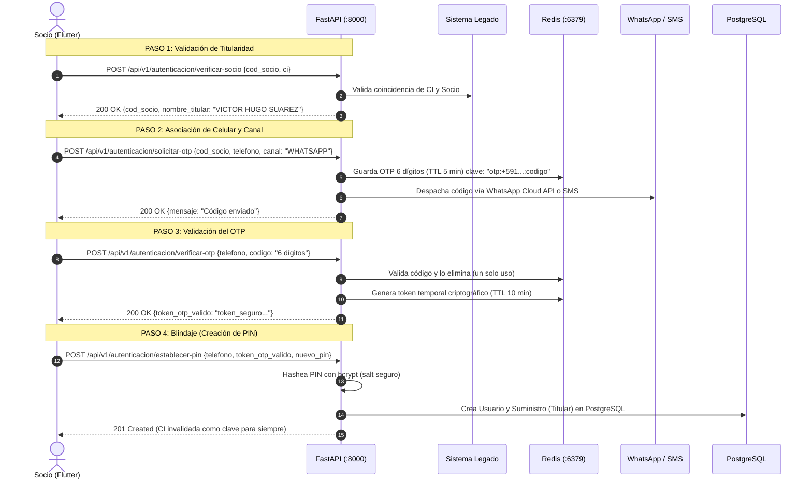

# Walkthrough Técnico: Flujos de Negocio, Autenticación y Arquitectura Backend
## Plataforma Omnicanal para Asociados — COSMOL R.L.

> **Documento de Estudio y Defensa Técnica**  
> **Fecha de consolidación:** Septiembre 2026  
> **Autor / Rol:** DEV 2 (Eduardo) y DEV 1 (Aireyu) — Backend FastAPI  
> **Estado de la Suite:** 70/70 tests aprobados en Docker al 100%  
> **Ubicación:** `Docs/backend/guias/GUIA_DEFENSA_Y_FLUJO_COMPLETO_BACKEND.md`

---

## 1. Visión General de la Arquitectura (BFF)

El backend actúa como un **BFF (Backend-for-Frontend)** desarrollado en **FastAPI (Python 3.12)**. Su propósito es desacoplar a la aplicación cliente (Flutter) del sistema comercial legado de COSMOL R.L., blindando la seguridad, absorbiendo picos de tráfico con Redis y exponiendo una API REST moderna con documentación OpenAPI/Swagger automática.



---

## 2. Modelo de Identidad y Base de Datos (PostgreSQL)

Para resolver el problema de que el sistema legado no cuenta con teléfonos ni contraseñas, el backend implementa una **separación estricta entre el Usuario Digital y el Suministro**:

```
 ┌────────────────────────────────┐         ┌────────────────────────────────┐
 │           USUARIOS             │         │          SUMINISTROS           │
 ├────────────────────────────────┤         ├────────────────────────────────┤
 │ id: UUID (PK)                  │1       N│ id: UUID (PK)                  │
 │ telefono: String (+591...)     ├─────────┤ usuario_id: UUID (FK)          │
 │ password_hash: String (bcrypt) │         │ cod_socio: String (Indexado)   │
 │ esta_activo: Boolean           │         │ rol: TITULAR / CONSULTA_PAGO   │
 │ intentos_fallidos: Integer     │         │ alias: String ("Mi Casa")      │
 │ bloqueado_hasta: Timestamp     │         │ es_suministro_principal: Bool  │
 └────────────────┬───────────────┘         └────────────────────────────────┘
                  │1
                  │N
 ┌────────────────┴───────────────┐
 │          DISPOSITIVOS          │
 ├────────────────────────────────┤
 │ id: UUID (PK)                  │
 │ usuario_id: UUID (FK)          │
 │ device_id: String (Hardware ID)│
 │ modelo_dispositivo: String     │
 │ ultimo_acceso: Timestamp       │
 └────────────────────────────────┘
```

---

## 3. Flujo Completo de Primer Ingreso (Onboarding de Saneamiento)

Dado que COSMOL no tiene teléfonos en su base de datos, el primer acceso es un **asistente seguro en 4 pasos**:



---

## 4. Flujo de Login Diario y Emisión de Tokens JWT

Cuando el socio ya completó el onboarding, su acceso habitual es rápido y seguro:

### Endpoint: `POST /api/v1/autenticacion/login`
**Payload de Entrada:**
```json
{
  "cod_socio": "556",
  "pin_password": "mi_pin_seguro",
  "device_id": "uuid-hardware-telefono",
  "modelo_dispositivo": "Samsung Galaxy A54"
}
```

### Ejecución Interna en el Backend:
1. **Comprobación de Bloqueo en Redis:**
   Verifica la clave `bloqueado:{cod_socio}`. Si existe, lanza `403 Forbidden` (`ACCOUNT_LOCKED`) con los segundos restantes.
2. **Localización de Credenciales:**
   Busca el `cod_socio` en la tabla `suministros` y carga al `Usuario` asociado.
3. **Verificación Bcrypt:**
   Ejecuta `bcrypt.checkpw(pin_password, password_hash)`.
   * *Si es erróneo:* Incrementa `intentos_fallidos:{cod_socio}` en Redis. Al llegar a 3 fallos consecutivos, bloquea la cuenta (1 min -> 5 min -> 15 min -> 1 hora) y retorna `401/403`.
   * *Si es correcto:* Limpia contadores de fallos y bloqueos en Redis.
4. **Control de Sesión Única por Hardware:**
   Actualiza la tabla `dispositivos` y guarda en Redis:  
   `SET sesion_activa:{user_id} "{device_id}"`.  
   *(Si el socio inicia sesión en otro teléfono, la sesión anterior queda revocada al renovar token).*
5. **Emisión de Tokens Criptográficos (JWT):**
   * **`access_token` (Vida corta: 15 minutos):** Firmado con clave secreta y algoritmo HS256. Lleva en el payload el `sub` (User ID), `cod_socio`, `device_id` y `type: "access"`.
   * **`refresh_token` (Vida larga: 7 días):** Token de renovación silenciosa con `type: "refresh"`.
   * **Respuesta:** Objeto `TokenResponse` con tokens y lista de suministros vinculados.

---

## 5. Protección de Endpoints y Renovación Silenciosa

### ¿Cómo se protegen los endpoints?
Cualquier endpoint privado (deuda, documentos, consumos) requiere la dependencia FastAPI `Depends(get_token_payload)` o `Depends(get_current_user_id)`:
```http
Authorization: Bearer <access_token>
```
1. Decodifica el token con `jwt.decode()`.
2. Verifica la firma criptográfica (rechaza si fue alterado con `401 AUTH_TOKEN_INVALID`).
3. Verifica la expiración (`exp`). Si pasaron más de 15 minutos, rechaza con `401 AUTH_TOKEN_EXPIRED`.
4. Extrae el `user_id` del payload sin consultar la base de datos (Stateless).

### Renovación Silenciosa (`POST /api/v1/autenticacion/renovar-token`):
Cuando el `access_token` expira a los 15 minutos:
1. Flutter intercepta el 401 y envía `refresh_token` + `device_id`.
2. El backend verifica en Redis:
   ```python
   device_activo = await redis.get(f"sesion_activa:{user_id}")
   if device_activo != device_id:
       raise UnauthorizedException("Sesión cerrada: se inició sesión en otro dispositivo.")
   ```
3. Si el dispositivo coincide, emite un nuevo `access_token` de 15 minutos sin pedir credenciales al usuario.

---

## 6. Consulta de Deuda y Caching Redis (Fase 2)

### Endpoint: `GET /api/v1/deuda/{cod_socio}`
* **Estrategia Redis (<20 ms):**  
  Clave: `deuda:{cod_socio}` con TTL de 10 minutos (600 segundos).
  * **Cache-Hit:** Si la clave existe en Redis, responde en **< 20 milisegundos**.
  * **Cache-Miss:** Consulta asíncrona (`httpx`) al sistema comercial legado de COSMOL, normaliza los datos en moneda local (**Bs**), guarda en Redis y responde.
* **Semaforización:**
  * Si la fecha límite expiró: `esta_vencido = True` (Flutter renderiza en rojo).
  * Si adeuda $\ge 2$ facturas: `alerta_corte = True` (banner preventivo de suspensión).
* **Invalidación Forzada:** `POST /api/v1/deuda/{cod_socio}/invalidar-cache`.

---

## 7. Repositorio Digital de Documentos y Streaming PDF (Fase 3)

### Endpoint: `GET /api/v1/documentos/{doc_id}/descargar`
* **Almacenamiento de Objetos en MinIO (S3):** Bucket privado `cosmol-docs`.
* **Motor Generador Vectorial (`generador_pdf.py` con ReportLab):**  
  Si el PDF no existe en MinIO, lo dibuja on-demand con membrete institucional de COSMOL R.L., NIT, código SIAT, detalle en Bs y códigos de barra.
* **Descarga en Streaming Binario:**  
  Usa `StreamingResponse` con `media_type="application/pdf"`. No satura la memoria RAM del servidor porque transmite el archivo por fragmentos.
* **Privacidad Multicuenta:**
  * **TITULAR:** Puede ver y descargar Facturas con valor legal, Avisos de Cobranza y Avisos de Corte.
  * **INQUILINO (`CONSULTA_PAGO`):** **Solo puede ver y descargar Avisos de Cobranza**. Si intenta acceder a facturas oficiales o avisos de corte, el backend responde con **`403 Forbidden` (`DOCUMENT_ACCESS_DENIED`)**.
* **Auditoría:** Cada descarga despacha un evento `DOCUMENT_DOWNLOADED` en segundo plano hacia `ChatbotReportes`.
