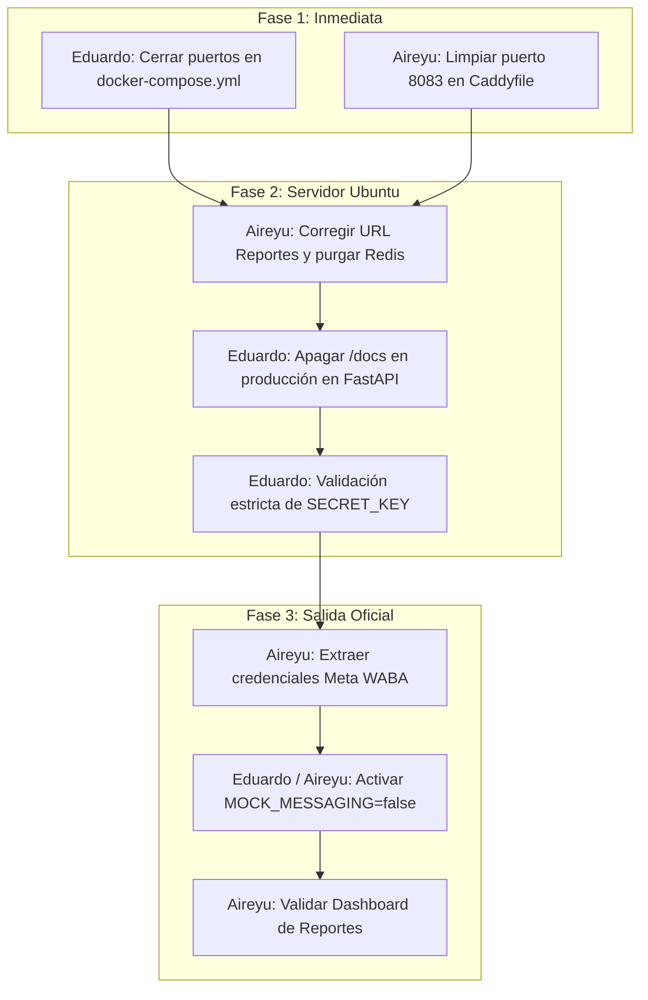

# Plan Maestro de Solución Unificada: Seguridad, Red y Estabilización de Producción

> **Ecosistema Integrado:** `COSMOL-app` (App de Socios) · `Cosmol-Chatbot` (Proxy Caddy & Bot WhatsApp) · `COSMOL-Reportes` (Dashboard de Auditoría y Operaciones)  
> **Servidor Central de Despliegue:** Ubuntu Server (`10.129.1.105`)  
> **Dominio Oficial:** `https://chatbot.cosmol.com.bo`  
> **Fecha:** Octubre 2026  
> **Propósito:** Unificar las observaciones operativas de infraestructura de Aireyu con el diagnóstico de seguridad y hardening, estableciendo una hoja de ruta clara y dividida por responsabilidades individuales.

---

## 1. División Estricta de Responsabilidades

Para evitar solapamientos y preservar la integridad de cada proyecto:

| Responsable | Repositorios y Alcance de Trabajo | Enfoque Principal |
|---|---|---|
| **Eduardo** | **`COSMOL-app`** (Backend FastAPI, `docker-compose.yml` de la App, Frontend Flutter, configuraciones `.env` locales/plantilla). | **Seguridad del BFF, blindaje de contenedores de la app, control de endpoints y variables.** |
| **Aireyu** | **`Cosmol-Chatbot`** (Proxy Caddy, puertos de pasarela, enrutamiento SSL), **`COSMOL-Reportes`** (API PHP, base de datos de reportes) y **Configuración Host del Servidor Ubuntu (`10.129.1.105`)**. | **Enrutamiento perimetral, infraestructura host, proveedor de tokens Meta/WABA y estabilidad de auditoría.** |

---

## 2. Diagnóstico Raíz: Por qué se Unifican las Soluciones

El análisis demostró que las observaciones de Aireyu (en [SEGUIMIENTO_CAMBIOS_Y_PENDIENTES_PRODUCCION.md](file:///c:/Users/Lenovo/Desktop/COSMOL-app/Docs/pendiente/SEGUIMIENTO_CAMBIOS_Y_PENDIENTES_PRODUCCION.md)) y el diagnóstico de seguridad abordan **la misma infraestructura desde dos caras de la misma moneda**:

```
           [ Visiòn de Aireyu: Operatividad ]          [ Visión de Seguridad: Hardening ]
       "Evitar que los puertos choquen con el host" ◄──► "Cerrar los puertos a internet público"
                                    │                                  │
                                    └──────────────┬───────────────────┘
                                                   ▼
                                        [ SOLUCIÓN UNIFICADA ]
                     "Eliminar el mapeo público de puertos en Docker Compose:
                   resuelve la colisión en el servidor Y blinda la base de datos"
```

### Cuadro de Equivalencia de Incidencias

| # | Observación de Aireyu (Operativa) | Diagnóstico de Seguridad (Riesgo) | Solución Unificada Definitiva | Responsable |
|---|---|---|---|---|
| **1** | **Colisión de puerto 5432** en host si existe otro PostgreSQL. | **Exposición crítica de DB y Redis** a internet (`0.0.0.0:5432` y `6379`). | **Eliminar mapeo de puertos públicos** de Postgres y Redis en Docker Compose. La app se comunica por red interna Docker (`cosmol-net`). | **Eduardo** |
| **2** | **Puerto 8083 huérfano** en Caddy pero no expuesto en Compose de Chatbot. | Superficie de ataque innecesaria; apertura de puertos no estándar. | **Eliminar bloque 8083 de Caddyfile** y consolidar todo en el puerto estándar `443` HTTPS. | **Aireyu** |
| **3** | **Timeouts de auditoría (3s)** y saturación en Redis por ruta duplicada y puerto 8082. | Denegación de servicio interna y acumulación descontrolada de memoria. | Configurar `REPORTES_API_URL=http://172.17.0.1:8082/api` en el servidor y purgar la cola en Redis. | **Aireyu** |
| **4** | *(No contemplado en bitácora de Aireyu)* | **Swagger UI y OpenAPI expuestos** públicamente en `/docs` en producción. | Condicionar `/docs` y `/openapi.json` para que se desactiven en producción. | **Eduardo** |
| **5** | **Falta de OTP WhatsApp real** (`MOCK_MESSAGING=true` en `.env`). | Bypass de autenticación (cualquiera entra con código mock `123456`). | Migrar a credenciales Meta WABA oficiales y pasar a `MOCK_MESSAGING=false`. | **Aireyu** (Tokens) / **Eduardo** (Código) |
| **6** | *(No contemplado en bitácora de Aireyu)* | **Secretos por defecto** en `config.py` (`SECRET_KEY`, pass de DB). | Generar claves aleatorias seguras de 256 bits y actualizar en servidor. | **Eduardo** (Validación) / **Aireyu** (Servidor) |

---

## 3. Plan de Trabajo Detallado por Responsable

---

### 👨‍💻 PARTE 1: Tareas de Eduardo (`COSMOL-app`)

Eduardo trabaja exclusivamente dentro del repositorio **`COSMOL-app`**.

#### Tarea E1: Blindaje de Puertos en `docker-compose.yml`
* **Archivo:** [`COSMOL-app/docker-compose.yml`](file:///c:/Users/Lenovo/Desktop/COSMOL-app/docker-compose.yml)
* **Problema:** Los servicios `db-postgres` (línea 37) y `cache-redis` (línea 59) exponen `"5432:5432"` y `"6379:6379"` en `0.0.0.0`. Asimismo, `backend-api` expone `"8000:8000"`.
* **Solución Técnica:**
  1. En `db-postgres`: Quitar `ports: - "5432:5432"` o reemplazar por `127.0.0.1:5435:5432` (solo accesible por loopback local para mantenimiento SSH/DBeaver).
  2. En `cache-redis`: Quitar `ports: - "6379:6379"`. FastAPI se comunica por `cache-redis:6379` a nivel de red interna Docker.
  3. En `storage-minio`: Vincular a loopback `127.0.0.1:9000:9000` y `127.0.0.1:9001:9001` si no se accede directamente desde internet.
  4. En `backend-api`: Cambiar `"8000:8000"` por `"127.0.0.1:8000:8000"` para que nadie pueda saltarse el proxy Caddy accediendo directo a la IP en el puerto 8000.
* **Resultado:** Cero colisiones con el sistema operativo host y cero exposición de bases de datos hacia el exterior.

#### Tarea E2: Ocultar Swagger UI y OpenAPI en Producción
* **Archivos:** [`backend/app/main.py`](file:///c:/Users/Lenovo/Desktop/COSMOL-app/backend/app/main.py#L44-L52) y [`backend/app/core/config.py`](file:///c:/Users/Lenovo/Desktop/COSMOL-app/backend/app/core/config.py#L14-L16)
* **Problema:** `docs_url="/docs"`, `redoc_url="/redoc"` y `openapi_url="/openapi.json"` están activados incondicionalmente, dejando al descubierto todos los endpoints en `https://chatbot.cosmol.com.bo/docs`.
* **Solución Técnica:**
  * En `config.py`, agregar la propiedad o flag `ENABLE_SWAGGER: bool = False` cuando `ENVIRONMENT == "production"`.
  * En `main.py`, inicializar FastAPI evaluando el entorno:
    ```python
    app = FastAPI(
        title=settings.PROJECT_NAME,
        version=settings.VERSION,
        description="API REST Backend (BFF) para la plataforma de socios de COSMOL R.L.",
        docs_url="/docs" if settings.ENVIRONMENT != "production" else None,
        redoc_url="/redoc" if settings.ENVIRONMENT != "production" else None,
        openapi_url="/openapi.json" if settings.ENVIRONMENT != "production" else None,
        lifespan=lifespan
    )
    ```

#### Tarea E3: Endurecimiento de Validación de Secretos
* **Archivo:** [`backend/app/core/config.py`](file:///c:/Users/Lenovo/Desktop/COSMOL-app/backend/app/core/config.py#L18)
* **Problema:** Si el archivo `.env` en producción no define `SECRET_KEY`, la aplicación usa la clave insegura por defecto sin avisar.
* **Solución Técnica:**
  * Agregar un validador en Pydantic (`@field_validator("SECRET_KEY")`) para que, si `ENVIRONMENT == "production"` y la clave contiene `"change_in_production"`, el backend lance un error impidiendo arrancar con credenciales inseguras.

#### Tarea E4: Soporte y Verificación de Mensajería WhatsApp OTP
* **Archivos:** [`backend/app/services/messaging_service.py`](file:///c:/Users/Lenovo/Desktop/COSMOL-app/backend/app/services/messaging_service.py) y `.env.example`
* **Acción:** Asegurar que cuando Aireyu entregue las credenciales de WhatsApp Cloud API (`WHATSAPP_PHONE_NUMBER_ID` y `WHATSAPP_ACCESS_TOKEN`), el servicio cambie limpiamente de modo Mock a modo Real sin modificaciones de código adicionales.

---

### 🛠️ PARTE 2: Tareas de Aireyu (`Cosmol-Chatbot`, `COSMOL-Reportes` y Servidor)

Aireyu trabaja exclusivamente en los repositorios de **Chatbot**, **Reportes** y la administración del servidor Ubuntu.

#### Tarea A1: Depuración del Puerto 8083 en Proxy Caddy
* **Repositorio:** `Cosmol-Chatbot`
* **Archivos:** `Cosmol-Chatbot/Caddyfile` y `Cosmol-Chatbot/docker-compose.yml`
* **Problema:** En `Caddyfile` existe un bloque para el puerto 8083 (`:8083`), pero Caddy no tiene expuesto ese puerto en su `docker-compose.yml`. Además, la app ya consume limpiamente por el puerto 443 estándar (`https://chatbot.cosmol.com.bo/api/v1`).
* **Solución Técnica:**
  * Retirar el bloque de respaldo `:8083` en `Caddyfile`.
  * Mantener el enrutamiento limpio y unificado en el puerto `443` estándar con TLS.
  * Reiniciar Caddy: `docker compose restart caddy`.

#### Tarea A2: Conectividad Interna de Auditoría y Purga de Cola en Servidor
* **Repositorio / Servidor:** `10.129.1.105` (Ubuntu Server) / `COSMOL-Reportes`
* **Problema:** `REPORTES_API_URL` en el servidor intentaba acceder por el dominio público en el puerto 8082, generando timeout de 3 segundos y saturando Redis con 60 eventos encolados.
* **Solución Técnica (Comandos directos en servidor):**
  1. En el archivo `.env` de producción de `COSMOL-app`, fijar la URL interna correcta:
     ```env
     REPORTES_API_URL=http://172.17.0.1:8082/api
     ```
  2. Purgar la cola de eventos atascados con timeout en Redis:
     ```bash
     docker exec -it cosmol-cache-redis redis-cli del auditoria:cola_pendientes
     ```
  3. Reiniciar el contenedor del backend para refrescar variables y conexiones:
     ```bash
     docker compose restart backend-api
     ```
  4. Verificar en los logs que no haya errores de timeout:
     ```bash
     docker logs -f --tail 50 cosmol-backend-api
     ```

#### Tarea A3: Provisión de Credenciales Meta Cloud API (WhatsApp WABA)
* **Origen:** Cuenta de Meta Business Suite / Configuración oficial de `Cosmol-Chatbot`.
* **Acción:**
  * Extraer el `WHATSAPP_PHONE_NUMBER_ID` y generar un token permanente (`WHATSAPP_ACCESS_TOKEN`) desde la aplicación oficial de Meta Cloud API de COSMOL.
  * Proporcionar las credenciales para inyectarlas en el `.env` del servidor.
  * Verificar en Meta Business Suite que la plantilla `codigo_autenticacion_cosmol` se encuentre en estado **APPROVED**.

#### Tarea A4: Monitoreo en Panel de COSMOL-Reportes
* **Repositorio:** `COSMOL-Reportes`
* **Acción:** Comprobar en la vista `/reportes/app-socios` que las consultas y accesos generados desde la aplicación móvil de socios se registren con timestamp, socio y tipo de acción, y que el botón *"Exportar CSV"* descargue los registros sin error.

---

## 4. Cronograma de Ejecución y Dependencias



---

## 5. Checklist de Verificación y Aceptación Final

Al finalizar las tareas, se deben cumplir los siguientes criterios técnicos:

- [ ] **Puertos Seguros:** Un escaneo de puertos sobre la IP del servidor no muestra expuestos los puertos `5432`, `6379`, `9000` ni `8000`.
- [ ] **Sin Colisiones:** `docker compose up -d` en `COSMOL-app` arranca sin advertencias de `port already in use`.
- [ ] **Navegación Móvil Rápida:** La app en Android/Web responde en menos de 300 ms sin retardos por timeout de auditoría.
- [ ] **Auditoría Fluida:** Redis mantiene la clave `auditoria:cola_pendientes` vacía o en 0 elementos tras una consulta normal.
- [ ] **API Documentación Protegida:** Intentar acceder a `https://chatbot.cosmol.com.bo/docs` devuelve HTTP 404 en producción.
- [ ] **OTP por WhatsApp Real:** Al registrarse un socio nuevo, el código de 6 dígitos llega al número celular registrado vía la API oficial de WhatsApp.
