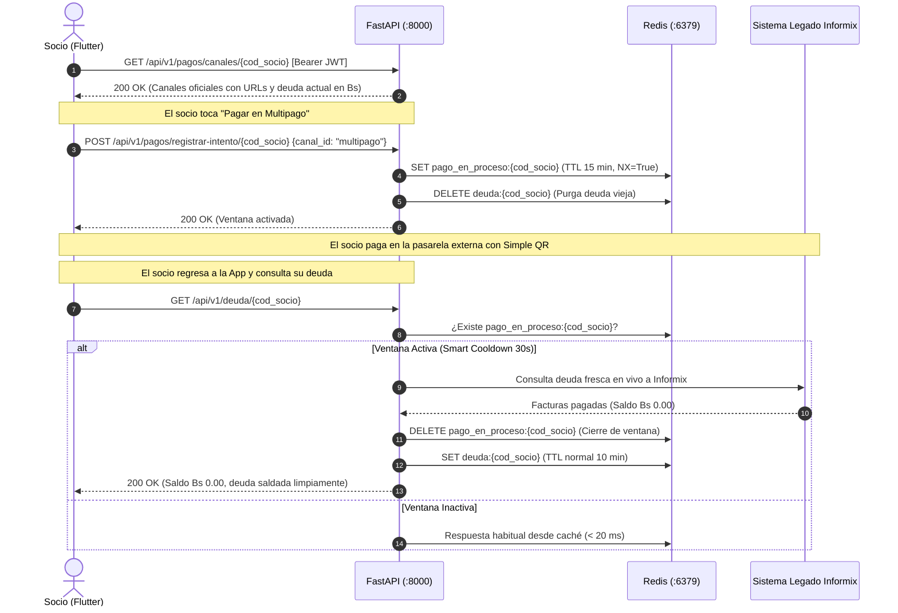

# Tarea 05: Pasarelas de Pago Externas (Multipago / Pago al Paso) y Actualización Dinámica de Deuda

> **Estado:** PENDIENTE  
> **Fase:** Fase 5 — Redirección a Pasarelas de Pago, Ventana de Verificación y Actualización de Deuda  
> **Fecha de formulación:** Septiembre 2026  
> **Entorno de ejecución:** Backend FastAPI en Docker (`cosmol-backend-api`, `cosmol-cache-redis`, `cosmol-db-postgres`)  
> **Documentos de referencia:** `AGENTS.md` (Secciones 4.3, 10.3, 12.4), `HOJA_DE_RUTA_DESARROLLO.md` (Fase 5) y Arquitectura de Producción de `Cosmol-Chatbot`.  
> **Asignación Modular:** DEV 1 (Aireyu) y DEV 2 (Eduardo)

---

## 1. Realidad Operativa y Arquitectura de Pagos de COSMOL

A partir de la infraestructura de producción del Chatbot oficial de COSMOL y el análisis de la red bancaria boliviana, se establece la realidad técnica de recaudación:

```text
💳 Canales de pago seguro oficiales de COSMOL R.L.:
• Multipago Bolivia: https://multipago.com/service/cosmol_payment/first
• Pago al Paso:     https://red.pagoalpaso247.net/servicio/cosmol
```

### 1.1 Modelo Conceptual: Pasarelas de Pago por Redirección (Hosted Checkout)
1. **Pasarelas Externas Autorizadas:**
   * **Multipago Bolivia** y **Pago al Paso** son entidades recaudadoras financieras autorizadas por la ASFI y el Banco Central de Bolivia (BCB).
   * En sus portales oficiales se genera el **Simple QR interoperable**, el cobro con tarjetas de débito/crédito y el enlace con la banca móvil de todos los bancos del país.
2. **Cero Exposición PCI-DSS (AGENTS.md Sección 4.3 y 12.4):**
   * COSMOL **no procesa pagos ni manipula números de tarjeta dentro de la app móvil ni en el backend**, liberando a la cooperativa de responsabilidades y certificaciones PCI-DSS.
3. **Inexistencia de Webhooks hacia la App Móvil:**
   * Las pasarelas liquidan y concilian el dinero directamente de servidor a servidor con el sistema central **SAI (IBM Informix)** de COSMOL. No emiten llamadas push/webhooks hacia la app de socios.
4. **URLs Servidas Dinámicamente desde el Backend:**
   * Las URLs de los canales de pago se configuran y entregan **exclusivamente desde el backend** mediante `GET /api/v1/pagos/canales/{cod_socio}`. Si COSMOL cambia un dominio o añade un nuevo canal (ej. BCP o Banco Unión), se actualiza en `.env` sin necesidad de recompilar ni republicar la app en Google Play / App Store.

---

## 2. Estrategia de Actualización de Deuda: Ventana de Verificación Inteligente (Smart Polling)

Para resolver el desfase de tiempo entre el pago en la pasarela externa y la actualización del saldo sin sobrecargar Informix ni depender de webhooks, se implementa una **Ventana de Verificación Post-Pago**:



### 2.1 Protección e Idempotencia ante Clics Repetidos
1. **Idempotencia con `SET NX`:**  
   Al registrar el intento, Redis utiliza `SET pago_en_proceso:{cod_socio} "activo" EX 900 NX`. Si el socio da 2 o más clics seguidos a la URL, Redis ignora los clics posteriores y preserva el contador original de 15 minutos sin corromper la memoria ni reiniciar el tiempo.
2. **Micro-TTL / Cooldown de Seguridad (30 a 45 segundos):**  
   Durante la ventana de verificación, las consultas a Informix se protegen con una micro-caché de 30 a 45 segundos. Si el socio refresca la pantalla 5 veces en 10 segundos, solo la primera consulta viaja a Informix; las restantes responden desde la micro-caché en `< 2 ms`, protegiendo la base de datos de COSMOL contra saturación.
3. **Cierre Automático:**  
   En cuanto Informix responda que el saldo es `0.00 Bs`, el backend elimina la clave `pago_en_proceso:{cod_socio}` y restablece la caché regular de 10 minutos.

---

## 3. Asignación y División Modular de Trabajo

```
┌────────────────────────────────────────────────────────────────────────┐
│                   DIVISIÓN MODULAR FASE 5 (SOLO BACKEND)               │
├───────────────────────────────────┬────────────────────────────────────┤
│       DEV 1 (Aireyu)              │       DEV 2 (Eduardo)              │
├───────────────────────────────────┼────────────────────────────────────┤
│ • Variables de Configuración      │ • Esquemas Pydantic v2             │
│   centralizada de Pasarelas       │   (`schemas/pago.py`)              │
│   (`core/config.py`)              │ • Servicio de Negocio de Pagos     │
│ • Servicio de Caché Redis         │   (`servicio_pagos.py`)            │
│   (Ventana de Verificación & NX)  │ • Endpoints REST de Canales e      │
│   (`servicio_cache_pagos.py`)     │   Intención (`api/v1/pagos.py`)    │
│ • Modelo PostgreSQL de Auditoría  │ • Soporte `forzar_refresco` en     │
│   de Clics a Pasarelas            │   endpoint `/deuda/{cod_socio}`    │
│   (`models/pago.py`)              │ • Despacho de Auditoría Asíncrono  │
│ • Tests DEV 1 (Caché & Config)    │ • Tests DEV 2 (Endpoints y Flujo)  │
└───────────────────────────────────┴────────────────────────────────────┘
```

---

## 4. Detalle de Entregables Técnicos

### 4.1 Entregables de DEV 1 (Aireyu): Configuración, Caché Redis y Persistencia

#### A. Variables de Configuración Oficiales (`backend/app/core/config.py`):
- [ ] Incorporar parámetros de pasarelas y control de tiempos:
  ```python
  URL_MULTIPAGO_COSMOL: str = "https://multipago.com/service/cosmol_payment/first"
  URL_PAGO_AL_PASO_COSMOL: str = "https://red.pagoalpaso247.net/servicio/cosmol"
  VENTANA_VERIFICACION_PAGO_SEGUNDOS: int = 900  # 15 minutos
  COOLDOWN_VERIFICACION_PAGO_SEGUNDOS: int = 30  # Micro-TTL anti-saturación Informix
  ```

#### B. Servicio de Caché en Redis (`backend/app/services/servicio_cache_pagos.py`):
- [ ] `activar_ventana_verificacion(redis: Redis, cod_socio: str, ttl: int = 900) -> bool`:
  - Ejecuta `SET pago_en_proceso:{cod_socio} "activo" EX ttl NX`.
  - Invalida la clave de deuda `deuda:{cod_socio}`.
  - Retorna `True` si activó la ventana por primera vez o `False` si ya estaba activa (idempotente).
- [ ] `esta_en_ventana_verificacion(redis: Redis, cod_socio: str) -> bool`:
  - Comprueba si existe la clave en Redis.
- [ ] `cerrar_ventana_verificacion(redis: Redis, cod_socio: str) -> None`:
  - Elimina `pago_en_proceso:{cod_socio}` al constatar deuda saldada.

#### C. Modelo en PostgreSQL (`backend/app/db/models/pago.py`):
- [ ] Tabla `auditoria_pagos_redireccion`:
  - `id`: UUID (PK)
  - `usuario_id`: UUID (FK a `usuarios.id`)
  - `cod_socio`: String (indexado)
  - `canal_id`: String (`"multipago"`, `"pago_al_paso"`)
  - `monto_deuda_bs`: Numeric(10, 2)
  - `ip_origen`: String opcional
  - `creado_en`: DateTime(timezone=True, default=utcnow)
- [ ] Exportar modelo en `backend/app/db/models/__init__.py`.

#### D. Batería de Pruebas DEV 1 (`backend/tests/test_cache_pagos.py`):
- [ ] Prueba de activación atómica de ventana con opción `NX=True`.
- [ ] Prueba de no alteración ni bugeo ante doble clic consecutivo.
- [ ] Prueba de expiración de ventana por TTL (900s) y cierre manual.

---

### 4.2 Entregables de DEV 2 (Eduardo): Esquemas, Lógica de Negocio y Endpoints

#### A. Esquemas Pydantic v2 (`backend/app/schemas/pago.py`):
- [ ] `CanalPagoItem`:
  - `id`: str (`"multipago"` | `"pago_al_paso"`)
  - `nombre`: str (`"Multipago Bolivia"`, `"Pago al Paso 24/7"`)
  - `descripcion`: str (`"Pago con Simple QR, Tarjetas de Débito/Crédito y Banca por Internet"`)
  - `url_redireccion`: str (URL oficial)
  - `icono`: str (`"qr_code"`, `"storefront"`)
  - `soporta_qr`: bool = True
  - `activo`: bool = True
- [ ] `CanalesPagoResponse`:
  - `cod_socio`: str
  - `total_deuda_bs`: float
  - `cant_facturas_pendientes`: int
  - `canales`: List[CanalPagoItem]
  - `mensaje_ayuda`: str
- [ ] `RegistrarIntentoPagoRequest`:
  - `canal_id`: str (ej. `"multipago"`)
- [ ] `RegistrarIntentoPagoResponse`:
  - `exito`: bool
  - `mensaje`: str
  - `url_redireccion`: str
  - `ventana_verificacion_activa`: bool
- [ ] `EstadoVerificacionPagoResponse`:
  - `cod_socio`: str
  - `deuda_saldada`: bool
  - `saldo_actual_bs`: float
  - `mensaje`: str

#### B. Servicio de Negocio (`backend/app/services/servicio_pagos.py`):
- [ ] `obtener_canales_pago(usuario_id: UUID, cod_socio: str, db: AsyncSession) -> CanalesPagoResponse`:
  - Valida pertenencia del suministro al usuario autenticado en PostgreSQL.
  - Obtiene la deuda actual mediante el servicio de deuda de COSMOL.
  - Entrega el catálogo oficial de canales disponibles.
- [ ] `registrar_intento_pago(usuario_id: UUID, cod_socio: str, canal_id: str, db: AsyncSession, redis: Redis, background_tasks: BackgroundTasks) -> RegistrarIntentoPagoResponse`:
  - Activa la ventana de verificación en Redis con `NX=True`.
  - Invalida la clave de caché vieja de deuda.
  - Guarda el registro de intención en PostgreSQL (`auditoria_pagos_redireccion`).
  - Despacha el evento asíncrono `PAYMENT_CHANNEL_SELECTED` hacia `ChatbotReportes`.
- [ ] `verificar_estado_post_pago(usuario_id: UUID, cod_socio: str, db: AsyncSession, redis: Redis) -> EstadoVerificacionPagoResponse`:
  - Consulta en vivo la deuda en Informix.
  - Si el saldo es 0 Bs, llama a `cerrar_ventana_verificacion`.

#### C. Endpoints REST:
- [ ] **`backend/app/api/v1/pagos.py`**:
  - `GET /api/v1/pagos/canales/{cod_socio}`: Retorna canales oficiales y saldo pendiente.
  - `POST /api/v1/pagos/registrar-intento/{cod_socio}`: Registra el clic e inicia la ventana.
  - `GET /api/v1/pagos/verificar-estado/{cod_socio}`: Verificación rápida de impacto del pago.
- [ ] **`backend/app/api/v1/deuda.py`**:
  - Añadir soporte para `forzar_refresco: bool = Query(default=False)`.
  - Integrar la detección de `pago_en_proceso`: si la ventana está activa, aplicar micro-TTL de 30s en lugar de 10 minutos.
- [ ] Registrar `pagos.router` en `backend/app/api/v1/router.py`.

#### D. Batería de Pruebas DEV 2 (`backend/tests/test_pagos.py`):
- [ ] Prueba de obtención de canales con URLs oficiales y montos exactos en Bs.
- [ ] Prueba de registro de intención con activación de ventana en Redis.
- [ ] Prueba de comportamiento del endpoint de deuda con `forzar_refresco=True`.
- [ ] Prueba de control de acceso JWT Bearer (401 si no está autenticado, 403 si el suministro no le pertenece).

---

## 5. Contrato de Integración para el Frontend Flutter (Solo Consumo de APIs)

El frontend de Flutter (manejado por Fabian) solo necesitará consumir estos endpoints estándar sin lógica financiera interna:

1. **Al presionar "Pagar Ahora" en el Dashboard:**
   - Consume `GET /api/v1/pagos/canales/{cod_socio}`.
   - Muestra un *BottomSheet* con los canales devueltos.
2. **Al tocar un canal (Multipago o Pago al Paso):**
   - Consume `POST /api/v1/pagos/registrar-intento/{cod_socio}` con `canal_id`.
   - Abre la URL recibida usando `url_launcher`:
     ```dart
     launchUrl(Uri.parse(canal.urlRedireccion), mode: LaunchMode.externalApplication);
     ```
3. **Al regresar al Dashboard (Pull-to-refresh o recarga):**
   - Consume `GET /api/v1/deuda/{cod_socio}?forzar_refresco=true`.
   - El backend responde de inmediato con el nuevo saldo actualizado.

---

## 6. Criterios de Aceptación y Certificación

1. [ ] **Catálogo Dinámico:** `GET /api/v1/pagos/canales/{cod_socio}` devuelve las pasarelas oficiales de COSMOL con sus URLs configuradas en el backend.
2. [ ] **Idempotencia y Resiliencia en Redis:** Múltiples clics seguidos a la URL de pago no generan errores ni reinicios descontrolados en Redis gracias al uso de `SET NX`.
3. [ ] **Protección a Informix:** La ventana de verificación respeta el cooldown de 30 segundos impidiendo saturación por refrescos compulsivos.
4. [ ] **Actualización Automática:** En cuanto Informix liquida la deuda, el backend cierra la ventana de verificación y muestra saldo Bs 0.00.
5. [ ] **Cero Mocks y 100% de Pruebas en Verde:** Toda la suite de pruebas corre dentro de Docker sumándose a los 90 tests actuales sin fallos.
