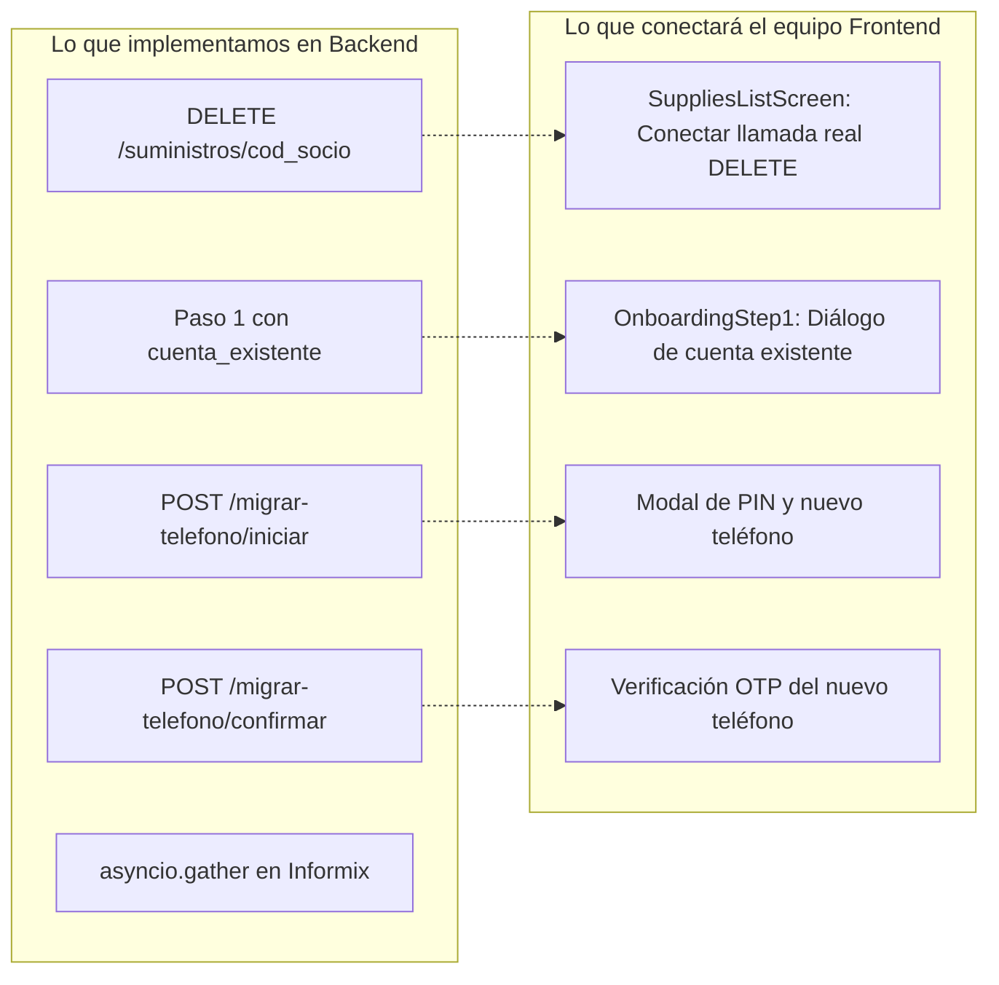

# Plan de Implementación Unificado: Desvinculación, Migración de Teléfono, Multicuenta y Recuperación de PIN

> **Módulos:** Identidad, Onboarding, Multicuenta y Seguridad (`features/auth`, `features/multicuenta`, `backend/app/api/v1/autenticacion.py`)  
> **Proyecto:** COSMOL RL — Plataforma Web y Móvil  
> **Fecha:** Octubre 2026  
> **Ubicación:** `Docs/backend/realizado/IMPLEMENTACION_DESVINCULACION_MIGRACION_MULTICUENTA.md`  
> **Estado:** Implementado y Operativo en Backend (Listo para integración Frontend)

---

## 1. Matriz de Inconsistencias Detectadas y Soluciones de Adaptación

Al contrastar la necesidad operativa con [`PLAN_LOGICA_MULTICUENTA_Y_LOGIN_TITULAR.md`](file:///d:/COSMOL-app/Docs/backend/guias/PLAN_LOGICA_MULTICUENTA_Y_LOGIN_TITULAR.md) y [`PLAN_RECUPERACION_PASSWORD_BACKEND.md`](file:///d:/COSMOL-app/Docs/backend/guias/PLAN_RECUPERACION_PASSWORD_BACKEND.md), se identificaron 5 inconsistencias críticas:

| Nro | Componente | Lo que decían las guías previas | Realidad / Inconsistencia | Solución de Adaptación Unificada |
|---|---|---|---|---|
| **1** | **Prefijo de Rutas API** | La guía de recuperación usa `/api/v1/auth/*`. | En el backend (`router.py`) y en Flutter, el prefijo oficial es `/api/v1/autenticacion/*`. Usar `/auth` daría **404 Not Found**. | Estandarizar **todas** las rutas bajo `/api/v1/autenticacion/*`. |
| **2** | **Paso 1 Onboarding (`verificar-primer-acceso`)** | Si el socio ya existe como titular, lanza un error HTTP 400 bloqueante. | Bloquea al usuario legítimo que cambió de número y le impide ver qué número tenía o solicitar el cambio de vinculación. | En vez de error 400 duro, devolver `200 OK` con `cuenta_existente: true` y `telefono_enmascarado: "+591 7*** **384"`. |
| **3** | **Recuperar PIN vs. Cambiar Número** | Solo contemplaba "Olvidé mi PIN" enviando OTP al número ya registrado en BD. | Si el socio **cambió de número o perdió el chip**, nunca recibirá el OTP de recuperación en su celular nuevo. | **Separar en 2 flujos:**<br>1. *Recuperar PIN:* PIN desconocido + Celular registrado (OTP va al número en BD).<br>2. *Migrar Teléfono:* PIN conocido + Celular nuevo (OTP va al **nuevo** celular tras validar PIN). |
| **4** | **Desvinculación Multicuenta** | La guía de multicuenta solo definió listar y vincular. El frontend llamó a `DELETE /suministros/{cod_socio}` que no existía. | La desvinculación en Flutter era un efecto óptico con `try/catch (_)`. Al reiniciar sesión volvía a aparecer. | Implementar el endpoint oficial `DELETE /api/v1/autenticacion/suministros/{cod_socio}` con borrado persistente en PostgreSQL. |
| **5** | **Rendimiento de Nombres Informix** | Bucle secuencial `for s in suministros: await cosmol_client.obtener_datos_socio(...)`. | Agrega 250ms por cada suministro vinculado, haciendo lentos el login y el listado. | Usar `asyncio.gather` concurrente + caché Redis en `socio:nombre:{cod_socio}` (TTL 24h). |

---

## 2. Los Dos Flujos de Identidad: Recuperación vs. Migración

```
┌────────────────────────────────────────────────────────────────────────────────────────┐
│ CASO A: OLVIDÉ MI PIN (Recuperación de Contraseña)                                     │
├────────────────────────────────────────────────────────────────────────────────────────┤
│ • Situación: El socio conserva su número de siempre, pero olvidó su clave/PIN.        │
│ • Entrada: cod_socio + CI.                                                             │
│ • Destino del OTP: Se envía ÚNICAMENTE al número almacenado en PostgreSQL.            │
│ • Resultado: Se crea un nuevo PIN.                                                     │
└────────────────────────────────────────────────────────────────────────────────────────┘

┌────────────────────────────────────────────────────────────────────────────────────────┐
│ CASO B: CAMBIÉ DE NÚMERO (Migración de Celular / Re-vinculación)                       │
├────────────────────────────────────────────────────────────────────────────────────────┤
│ • Situación: El socio tiene un chip/celular nuevo y quiere registrarse con este.       │
│ • Entrada: cod_socio + CI + PIN actual + nuevo_telefono.                               │
│ • Factor Anti-Fraude: Se exige el PIN actual para evitar que un ladrón de facturas     │
│   se apropie de la cuenta ajena.                                                       │
│ • Destino del OTP: Se envía al NUEVO número celular para comprobar su posesión.        │
│ • Resultado: Se actualiza Usuario.telefono en PostgreSQL y se revoca el celular viejo. │
└────────────────────────────────────────────────────────────────────────────────────────┘
```

---

## 3. Especificación de Endpoints y Contratos de Datos

Todos los endpoints bajo: `/api/v1/autenticacion`

### 3.1 Desvinculación de Suministros Secundarios
* **Ruta:** `DELETE /api/v1/autenticacion/suministros/{cod_socio}`
* **Auth:** Bearer Token JWT requerido (`usuario_id`).
* **Regla de Seguridad:** Solo se pueden desvincular suministros donde `es_suministro_principal == False`.
* **Respuestas:**
  * `200 OK`: `{"mensaje": "Suministro desvinculado exitosamente", "cod_socio": "556"}`
  * `400 BAD_REQUEST`: `"No es posible desvincular el suministro principal de su cuenta."`
  * `404 NOT_FOUND`: `"El suministro no está vinculado a su cuenta."`

---

### 3.2 Paso 1 Onboarding Enriquecido (Detección de Cuenta Previa)
* **Ruta:** `POST /api/v1/autenticacion/verificar-primer-acceso`
* **Request:** `{"cod_socio": "104523", "ci": "8392019"}`
* **Response 200 OK (Caso Nuevo Socio):**
  ```json
  {
    "valido": true,
    "cod_socio": "104523",
    "nombre": "JUAN PEREZ ROCHA",
    "cuenta_existente": false,
    "telefono_enmascarado": null
  }
  ```
* **Response 200 OK (Caso Cuenta Ya Registrada):**
  ```json
  {
    "valido": true,
    "cod_socio": "104523",
    "nombre": "JUAN PEREZ ROCHA",
    "cuenta_existente": true,
    "telefono_enmascarado": "+591 7*** **384"
  }
  ```

---

### 3.3 Migración Segura de Teléfono (Celular Nuevo)

#### Paso M.1: Iniciar Migración
* **Ruta:** `POST /api/v1/autenticacion/migrar-telefono/iniciar`
* **Request:**
  ```json
  {
    "cod_socio": "104523",
    "ci": "8392019",
    "pin_actual": "1234",
    "nuevo_telefono": "+59179998877",
    "canal": "WHATSAPP"
  }
  ```
* **Validación Backend:**
  1. Verifica `cod_socio` y `ci` con el sistema comercial.
  2. Valida `pin_actual` contra el hash bcrypt de la cuenta titular en PostgreSQL.
  3. Genera OTP de 6 dígitos en Redis (`otp_migracion:{session_id}`, TTL 5 min).
  4. Despacha el OTP al `nuevo_telefono`.
* **Response 200 OK:**
  ```json
  {
    "session_id": "mig_9b1deb4d-3b7d-4bad-9bdd-2b0d7b3dcb6d",
    "mensaje": "Código de seguridad enviado al nuevo número de teléfono.",
    "ttl_segundos": 300,
    "debug_codigo_otp": "482019"
  }
  ```

#### Paso M.2: Confirmar Migración
* **Ruta:** `POST /api/v1/autenticacion/migrar-telefono/confirmar`
* **Request:**
  ```json
  {
    "session_id": "mig_9b1deb4d-3b7d-4bad-9bdd-2b0d7b3dcb6d",
    "codigo_otp": "482019"
  }
  ```
* **Acción Backend:**
  1. Valida el código OTP.
  2. Actualiza `Usuario.telefono = nuevo_telefono` en PostgreSQL.
  3. Elimina `sesion_activa:{user_id}` en Redis (expulsa al celular viejo).
  4. Emite tokens de acceso JWT directos para ingresar a la app.
* **Response 200 OK:**
  ```json
  {
    "mensaje": "Teléfono actualizado exitosamente. Bienvenido a COSMOL.",
    "access_token": "eyJhbGciOi...",
    "refresh_token": "eyJhbGciOi...",
    "token_type": "bearer",
    "cod_socio": "104523",
    "nombre": "JUAN PEREZ ROCHA"
  }
  ```

---

## 4. Separación de Responsabilidades: Backend vs. Frontend



---

## 5. Cronograma de Ejecución Técnica Paso a Paso

### 🚀 Tarea 1: Red y Blindaje en Puerto 443 (Frontend & Docker)
* En `frontend/lib/core/network/app_config.dart`:
  * Default `APP_EXTERNAL_PORT` = `443` (o sin puerto en la URL para estándar SSL `https://chatbot.cosmol.com.bo/api/v1`).
  * En Android Debug, permitir dispositivo físico sin forzar `10.0.2.2`.
* En `.env.example`: `APP_EXTERNAL_PORT=443`.

### 🚀 Tarea 2: Guarda Anti-401 Prematuro (Frontend)
* En `frontend/lib/features/multicuenta/presentation/providers/multicuenta_provider.dart`:
  * Restaurar verificación de `storageService.getAccessToken()` antes de llamar a la API.

### 🚀 Tarea 3: Endpoint de Desvinculación de Suministros (Backend)
* En `backend/app/services/servicio_suministros.py`: implementar `desvincular_suministro(...)`.
* En `backend/app/api/v1/autenticacion.py`: registrar `DELETE /suministros/{cod_socio}`.

### 🚀 Tarea 4: Detección de Cuenta y Migración de Teléfono (Backend)
* En `backend/app/schemas/suministro.py` y `usuario.py`: definir esquemas de migración y flag `cuenta_existente`.
* En `backend/app/services/servicio_autenticacion.py`:
  * Ajustar `verificar_primer_acceso` para incluir `cuenta_existente` y `telefono_enmascarado`.
  * Implementar `iniciar_migracion_telefono` y `confirmar_migracion_telefono`.
* En `backend/app/api/v1/autenticacion.py`: exponer las rutas.

### 🚀 Tarea 5: Optimización de Rendimiento en Informix (Backend)
* En `backend/app/services/servicio_suministros.py` y `servicio_autenticacion.py`:
  * Reemplazar bucle secuencial por `asyncio.gather(*tareas, return_exceptions=True)`.
  * Añadir caché Redis `socio:nombre:{cod_socio}` (TTL 86400s).

### 🚀 Tarea 6: Restauración de `AGENTS.md`
* Restaurar la especificación completa del repositorio (1060 líneas) con las reglas de Clean Architecture y OWASP.

### 🚀 Tarea 7: Verificación y Certificación
* `dart analyze lib` (0 errores).
* `flutter test` (46 tests aprobados).
* `python -m py_compile` sobre el backend.
