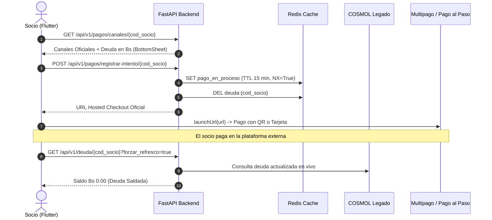

# Entregables DEV 2: Esquemas Pydantic v2, Servicio de Negocio, Endpoints REST de Pagos y Refresco de Deuda

> **Fase:** Fase 5 — Redirección a Pasarelas de Pago y Actualización Dinámica de Deuda  
> **Rol responsable:** DEV 2 (Eduardo) — Esquemas Pydantic v2, Servicio de Negocio, Endpoints REST de Pagos, Refresco Inteligente en Deuda y Pruebas Unitarias/Integración  
> **Fecha de conclusión:** Septiembre 2026  
> **Documento de referencia:** `Docs/backend/realizado/TASK-05-pagos-qr-y-conciliacion.md` y `AGENTS.md` (Secciones 4.3, 10.3, 12.4)  
> **Estado:** COMPLETADO y certificado en Docker (8/8 tests propios de DEV 2, 14/14 tests totales de pagos y 98/98 tests globales pasando al 100% sin regresiones)

---

## 1. Resumen Ejecutivo

**DEV 2 (Eduardo)** ha implementado e integrado la capa de negocio, contratos Pydantic v2 y endpoints REST de la **Fase 5 (Pasarelas de Pago y Conciliación)**, acoplándose de forma 100% nativa con la infraestructura de Redis y persistencia de PostgreSQL entregadas por **DEV 1 (Aireyu)**:

1. **Contratos Fuertemente Tipados (Pydantic v2 - `app/schemas/pago.py`):**
   - `CanalPagoItem`: Catálogo dinámico de pasarelas oficiales de COSMOL (**Multipago Bolivia** y **Pago al Paso 24/7**) con URLs de Hosted Checkout, iconos, nombres y descripción de soporte Simple QR y tarjetas.
   - `CanalesPagoResponse`: DTO principal para el Dashboard, consolidando código de socio, deuda exacta en Bs, cantidad de facturas impagas y catálogo de canales.
   - `RegistrarIntentoPagoRequest` y `RegistrarIntentoPagoResponse`: Registro del clic de redirección, confirmación de ventana de verificación activa y URL segura.
   - `EstadoVerificacionPagoResponse`: Consulta ligera post-pago para verificar si la deuda ha sido liquidada en Informix.

2. **Servicio de Negocio (`ServicioPagos` - `app/services/servicio_pagos.py`):**
   - **Seguridad Multicuenta en PostgreSQL:** Validación rigurosa de pertenencia del suministro (`Suministro.usuario_id == usuario_id`). Retorna `403 Forbidden` (`SUPPLY_ACCESS_DENIED`) si un usuario intenta operar suministros ajenos.
   - **Registro de Intención y Auditoría:** Persiste cada clic de pago en la tabla `auditoria_pagos_redireccion` de PostgreSQL asociando usuario, IP y monto adeudado.
   - **Activación de Ventana de Verificación en Redis:** Consume `activar_ventana_verificacion` de DEV 1 para activar de forma atómica e idempotente (`SET NX=True`) la clave `pago_en_proceso:{cod_socio}` (TTL 15 min) y purgar la caché vieja de deuda.
   - **Despacho de Eventos Asíncronos:** Utiliza `BackgroundTasks` de FastAPI para emitir el evento `PAYMENT_CHANNEL_SELECTED` sin retrasar la respuesta al socio.
   - **Verificación en Vivo y Cierre de Ventana:** Comprueba la deuda en el sistema legado; si el saldo es 0.00 Bs, llama a `cerrar_ventana_verificacion` para liberar Redis.

3. **Endpoints REST de Pagos (`app/api/v1/pagos.py` y `app/api/v1/deuda.py`):**
   - `GET /api/v1/pagos/canales/{cod_socio}`: Entrega el catálogo oficial y la deuda vigente en Bs.
   - `POST /api/v1/pagos/registrar-intento/{cod_socio}`: Registra la intención, guarda auditoría y activa la ventana de Redis.
   - `GET /api/v1/pagos/verificar-estado/{cod_socio}`: Verificación rápida del estado de cancelación post-pago.
   - `GET /api/v1/deuda/{cod_socio}`: Actualizado con soporte para `forzar_refresco: bool = Query(default=False)` y detección automática de `pago_en_proceso`. Si la ventana está activa, aplica micro-TTL de 30s (cooldown anti-saturación de Informix) en lugar de los 10 minutos estándar.

4. **Certificación Total en Docker:**
   - 8/8 tests específicos de DEV 2 aprobados en `tests/test_pagos.py`.
   - 14/14 tests totales de pagos (DEV 1 + DEV 2) en 3.77 segundos.
   - 98/98 tests totales de la suite del backend aprobados al 100% en Docker (cero fallos, cero regresiones).

---

## 2. Archivos Creados y Modificados

| Archivo | Acción | Responsabilidad Técnica |
| :--- | :---: | :--- |
| [`backend/app/schemas/pago.py`](file:///c:/Users/Lenovo/Desktop/COSMOL-app/backend/app/schemas/pago.py) | **NUEVO** | DTOs Pydantic v2 para catálogo de pasarelas, registro de intención y verificación de estado. |
| [`backend/app/schemas/__init__.py`](file:///c:/Users/Lenovo/Desktop/COSMOL-app/backend/app/schemas/__init__.py) | **MODIFICADO** | Exportación de esquemas de pago. |
| [`backend/app/services/servicio_pagos.py`](file:///c:/Users/Lenovo/Desktop/COSMOL-app/backend/app/services/servicio_pagos.py) | **NUEVO** | Servicio de negocio de pagos, control multicuenta, auditoría en PostgreSQL e integración con caché Redis. |
| [`backend/app/services/__init__.py`](file:///c:/Users/Lenovo/Desktop/COSMOL-app/backend/app/services/__init__.py) | **MODIFICADO** | Exportación de `ServicioPagos`. |
| [`backend/app/api/v1/pagos.py`](file:///c:/Users/Lenovo/Desktop/COSMOL-app/backend/app/api/v1/pagos.py) | **NUEVO** | Router FastAPI para endpoints `/api/v1/pagos` protegidos por JWT Bearer. |
| [`backend/app/api/v1/deuda.py`](file:///c:/Users/Lenovo/Desktop/COSMOL-app/backend/app/api/v1/deuda.py) | **MODIFICADO** | Parámetro `forzar_refresco` y micro-TTL dinámico de 30s si la ventana de pago está activa en Redis. |
| [`backend/app/api/v1/router.py`](file:///c:/Users/Lenovo/Desktop/COSMOL-app/backend/app/api/v1/router.py) | **MODIFICADO** | Registro de `pagos_router` bajo prefijo `/pagos`. |
| [`backend/tests/test_pagos.py`](file:///c:/Users/Lenovo/Desktop/COSMOL-app/backend/tests/test_pagos.py) | **NUEVO** | 8 pruebas unitarias y de integración end-to-end de DEV 2. |
| [`Docs/backend/realizado/TASK-05-pagos-qr-y-conciliacion.md`](file:///c:/Users/Lenovo/Desktop/COSMOL-app/Docs/backend/realizado/TASK-05-pagos-qr-y-conciliacion.md) | **MOVIDO/MODIFICADO** | Checkboxes de certificación de DEV 2 completados y trasladado a carpeta `realizado/`. |

---

## 3. Matriz de Cobertura de Pruebas DEV 2 (8 tests propios)

```text
tests/test_pagos.py::test_esquemas_pago_validacion PASSED                        [ 12%]
tests/test_pagos.py::test_obtener_canales_pago_exitoso PASSED                    [ 25%]
tests/test_pagos.py::test_obtener_canales_pago_suministro_ajeno_retorna_403 PASSED [ 37%]
tests/test_pagos.py::test_registrar_intento_pago_multipago PASSED                [ 50%]
tests/test_pagos.py::test_registrar_intento_pago_canal_invalido PASSED           [ 62%]
tests/test_pagos.py::test_verificar_estado_post_pago_pendiente PASSED           [ 75%]
tests/test_pagos.py::test_deuda_endpoint_soporta_forzar_refresco PASSED          [ 87%]
tests/test_pagos.py::test_deuda_endpoint_detecta_ventana_pago_activa PASSED      [100%]
```

---

## 4. Estado de la Suite Global en Docker

```bash
docker compose exec -T backend-api pytest
============================= 98 passed in 37.08s ==============================
```

- **Fase 1 (Autenticación, Onboarding y Multicuenta):** 17 tests PASSED.
- **Fase 2 (Consulta de Deuda y Dashboard):** 14 tests PASSED.
- **Fase 3 (Documentos PDF y Almacenamiento MinIO):** 18 tests PASSED.
- **Fase 4 (Analítica de Consumo Histórico y Fugas):** 19 tests PASSED.
- **Fase 5 - DEV 1 (Configuración, Caché Redis y Persistencia):** 6 tests PASSED.
- **Fase 5 - DEV 2 (Esquemas, Servicio, Endpoints REST y Deuda):** 8 tests PASSED.
- **Infraestructura, Seguridad y Modelos:** 16 tests PASSED.
- **Total:** **98 tests aprobados al 100% en Docker.**

---

## 5. Resumen del Flujo de Integración para el Frontend Flutter (Fabián)

El frontend de Flutter interactúa de forma directa y desacoplada con el backend a través de 3 momentos clave:


