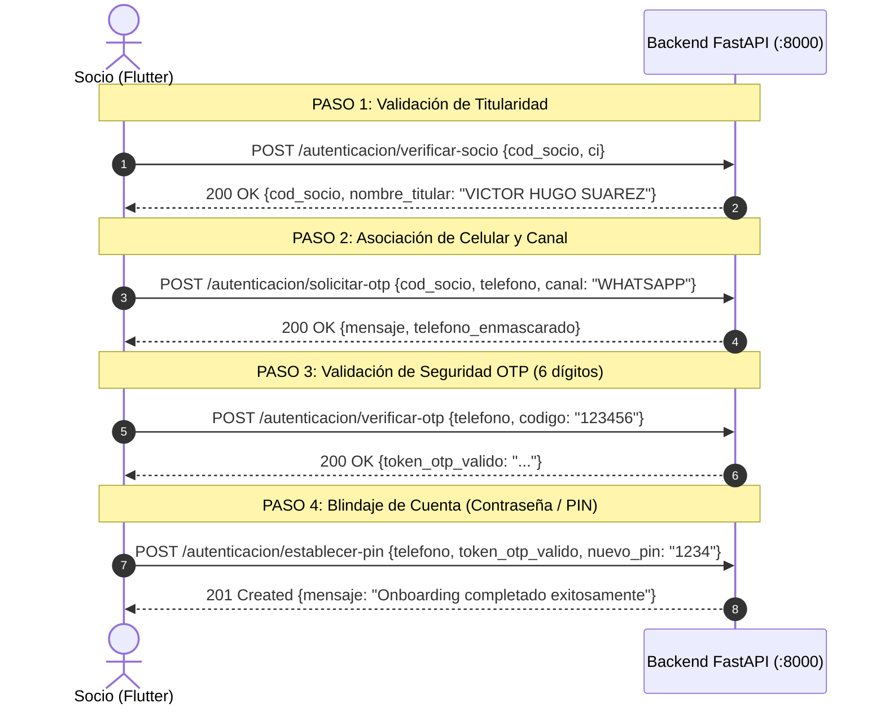

# Plan de Resolución de Inconsistencias: Frontend (Flutter) y Backend (FastAPI)

> **Fecha:** Septiembre 2026  
> **Estado:** APROBADO PARA EJECUCIÓN  
> **Documento de origen:** [`Docs/diagnostico-inconsistencias-frontend-backend.md`](file:///d:/COSMOL-app/Docs/diagnostico-inconsistencias-frontend-backend.md)  
> **Referencia arquitectónica:** [`AGENTS.md`](file:///d:/COSMOL-app/AGENTS.md) y [`Docs/GUIA_INTEGRACION_FRONTEND.md`](file:///d:/COSMOL-app/Docs/GUIA_INTEGRACION_FRONTEND.md)  
> **Nota previa:** La longitud del código OTP a **6 dígitos** ya ha sido resuelta en Frontend.

---

## 1. Visión General del Plan

Este documento consolida la hoja de ruta técnica unificada para que los equipos de **Backend** y **Frontend** sincronicen sus contratos, eliminen bloqueos y dejen el flujo de autenticación, onboarding, consulta de deuda y documentos 100% operativo de punta a punta.

```
┌─────────────────────────────────────────────────────────────────────────────────┐
│                    DIVISIÓN DE TRABAJO Y RESPONSABILIDADES                      │
├────────────────────────────────────────┬────────────────────────────────────────┤
│          BACKEND (FastAPI / Docker)    │           FRONTEND (Flutter)           │
├────────────────────────────────────────┼────────────────────────────────────────┤
│ • Tolerancia a minúsculas en canal     │ • Reordenar wizard de Onboarding       │
│   ('whatsapp', 'WhatsApp' -> 'WHATSAPP')│   (Socio+CI -> Teléfono+OTP -> PIN)    │
│ • Esquema permisivo en /establecer-pin │ • Conectar botón de Login real con API │
│   (ignorar campos extras sin error 422)│   (eliminar Future.delayed dummy)      │
│ • Documentación y soporte de pruebas   │ • Renombrar campo "Usuario" a "Socio"  │
│   con suite de 68 tests en verde       │ • Implementar Deuda y Docs (Fases 2 y 3│
└────────────────────────────────────────┴────────────────────────────────────────┘
```

---

## 2. Acciones y Cambios en el BACKEND

El backend ya cuenta con el 100% de la lógica de negocio construida y 68 tests aprobados en Docker. Los cambios a realizar en el backend son **mejoras de resiliencia y tolerancia** para facilitar la integración con la app móvil y web.

### 2.1 Normalización de Canal OTP en `SolicitarOtpRequest`
* **Archivo:** `backend/app/schemas/usuario.py`
* **Problema que resuelve:** El frontend en ocasiones envía `canal: "WhatsApp"` o `canal: "sms"`. Si el backend valida estrictamente un `Literal["WHATSAPP", "SMS"]`, Pydantic rechaza la petición con HTTP 422 antes de procesarla.
* **Solución técnica:**
  Agregar un validador con `mode="before"` que limpie y convierta el valor a mayúsculas antes de evaluar el literal:
  ```python
  @field_validator("canal", mode="before")
  @classmethod
  def normalizar_canal(cls, v: Any) -> str:
      if isinstance(v, str):
          return v.strip().upper()
      return v
  ```
* **Resultado:** El backend aceptará `"whatsapp"`, `"WhatsApp"`, `"WHATSAPP"`, `"sms"` o `"SMS"` indistintamente.

---

### 2.2 Flexibilidad en Esquema de Creación de PIN (`/establecer-pin`)
* **Archivo:** `backend/app/schemas/usuario.py`
* **Problema que resuelve:** El DTO de Flutter `RegisterCredentialsRequestModel` envía en el JSON campos de contexto como `cod_socio`, `ci` o `username`.
* **Solución técnica:**
  En `CrearPinPasswordRequest`, declarar explícitamente los campos opcionales y habilitar `extra = "ignore"`:
  ```python
  class CrearPinPasswordRequest(BaseModel):
      model_config = ConfigDict(extra="ignore")

      telefono: str = Field(...)
      token_otp_valido: str = Field(...)
      nuevo_pin: str = Field(..., min_length=4, max_length=30)
      cod_socio: Optional[str] = Field(None, description="Código de socio contextual")
      ci: Optional[str] = Field(None, description="CI contextual")
  ```
* **Resultado:** Nunca se producirá un error 422 si el cliente móvil envía metadatos contextuales en el cuerpo de la petición.

---

### 2.3 Certificación de Suite de Pruebas
* Ejecutar en Docker:
  ```bash
  docker compose exec backend-api pytest -v
  ```
  Garantizar que las 68 pruebas continúen pasando al 100% tras estos ajustes preventivos.

---

## 3. Acciones y Cambios en el FRONTEND (Flutter)

---

### 3.1 Reordenamiento del Flujo de Onboarding de Primer Acceso

#### Contexto de Negocio Inmutable (`AGENTS.md` Sección 4.1):
La base de datos de COSMOL **no cuenta con números telefónicos consolidados**. Por ende, la identidad del socio debe validarse con los únicos datos que el sistema comercial conoce: **Código de Socio + CI**. Solo tras validar esta coincidencia se captura el celular del socio y se le envía el código de seguridad.



#### Cambios Concretos en Archivos de Flutter:

1. **`frontend/lib/features/auth/presentation/screens/onboarding_screen.dart` (Paso 1):**
   * **Cambio:** Reemplazar el input de celular por el formulario de validación de socio:
     * Campo `Código de Socio` (numérico, ej: `556`, `540`, `104523`).
     * Campo `Carnet de Identidad (C.I.)` (ej: `4638847`).
     * Mantener la tarjeta de ayuda `BillGuideCard` que indica visualmente dónde encontrar estos datos en el aviso de cobranza.
   * Al pulsar "Verificar Socio", ejecutar:
     ```dart
     final exito = await ref.read(onboardingProvider.notifier).verificarSocio(
       codSocio: _socioController.text.trim(),
       ci: _ciController.text.trim(),
     );
     if (exito && mounted) {
       context.push('/onboarding/step2');
     }
     ```

2. **`frontend/lib/features/auth/presentation/screens/onboarding_step2_screen.dart` (Paso 2):**
   * **Cambio:** Esta pantalla ahora recibe al socio verificado:
     * Muestra tarjeta de bienvenida: *"Hola, ${state.nombreTitular}"*.
     * Solicita el **Número de Celular** (8 dígitos).
     * Selector de canal: **WhatsApp** (icono verde) o **SMS** (icono azul).
     * Botón "Enviar Código de Verificación" llamando a `solicitarOtp()`.
     * Al recibir confirmación, renderiza el componente `OtpVerificationArea` (6 dígitos).
     * Al validar el OTP, despliega el campo para crear el **Nuevo PIN personal** (4 a 6 dígitos) y botón final "Completar Registro".

3. **`frontend/lib/features/auth/presentation/providers/onboarding_provider.dart`:**
   * **Cambio:** Agregar el método `verificarSocio`:
     ```dart
     Future<bool> verificarSocio({required String codSocio, required String ci}) async {
       state = state.copyWith(isLoading: true, errorMessage: null);
       try {
         final res = await _repository.verificarSocio(codSocio: codSocio, ci: ci);
         state = state.copyWith(
           isLoading: false,
           codSocio: res.codSocio,
           nombreTitular: res.nombreTitular,
           currentStep: 2,
         );
         return true;
       } on AppException catch (e) {
         state = state.copyWith(isLoading: false, errorMessage: e.message);
         return false;
       }
     }
     ```
   * En `solicitarOtp()`, usar `state.codSocio` (el socio verificado en el paso anterior) y eliminar el valor por defecto quemado `'104523'`.

---

### 3.2 Conectar el Login Real en `login_screen.dart`

* **Archivo:** `frontend/lib/features/auth/presentation/screens/login_screen.dart`
* **Archivo:** `frontend/lib/features/auth/presentation/providers/auth_provider.dart`

#### Cambios Requeridos:
1. En `auth_provider.dart`, implementar el método `login` en `AuthNotifier`:
   ```dart
   Future<bool> login({
     required String codSocio,
     required String password,
   }) async {
     state = state.copyWith(isLoading: true, errorMessage: null);
     try {
       final deviceId = await _deviceService.getDeviceId();
       final response = await _repository.login(
         codSocio: codSocio,
         password: password,
         deviceId: deviceId,
         modeloDispositivo: await _deviceService.getDeviceModel(),
       );

       // Guardar tokens en almacenamiento seguro cifrado
       await _storageService.saveTokens(
         accessToken: response.accessToken,
         refreshToken: response.refreshToken,
       );

       state = state.copyWith(
         isLoading: false,
         status: AuthStatus.authenticated,
         usuario: response.usuario,
       );
       return true;
     } on AppException catch (e) {
       state = state.copyWith(
         isLoading: false,
         status: AuthStatus.unauthenticated,
         errorMessage: e.message,
       );
       return false;
     }
   }
   ```

2. En `login_screen.dart`, actualizar `_handleLogin()`:
   ```dart
   Future<void> _handleLogin() async {
     if (!_formKey.currentState!.validate()) return;

     final success = await ref.read(authProvider.notifier).login(
       codSocio: _socioController.text.trim(),
       password: _passwordController.text.trim(),
     );

     if (mounted && success) {
       context.go('/dashboard');
     }
   }
   ```

---

### 3.3 Corrección de Terminología: "Usuario" ➔ "Código de Socio"

1. En `login_screen.dart`:
   * Cambiar `label: 'Usuario'` a `label: 'Código de Socio'`.
   * Cambiar `hint: 'Ingrese su Usuario'` a `hint: 'Ej: 540, 104523'`.
   * Cambiar `keyboardType: TextInputType.number`.
2. En `onboarding_step2_screen.dart`:
   * Eliminar el input `_usernameController` y la etiqueta "Usuario". Los socios de COSMOL solo gestionan su Código de Socio y su PIN.

---

## 4. Próximos Pasos para Fase 2 (Deuda) y Fase 3 (Documentos) en Flutter

Una vez estabilizado el Onboarding y Login, el equipo de Frontend podrá consumir de inmediato los endpoints que el Backend ya tiene listos:

### 4.1 Módulo de Consulta de Deuda (Fase 2)
* **Endpoints a consumir:**
  * `GET /api/v1/deuda/dashboard/resumen`: Retorna el balance consolidado multicuenta en Bolivianos (Bs).
  * `GET /api/v1/deuda/{cod_socio}`: Detalle de facturas adeudadas y semáforo de vencimiento.
* **Pautas UI:**
  * Si `esta_vencido == true`: Renderizar fecha de vencimiento en rojo institucional (`#D32F2F`).
  * Si `alerta_corte == true`: Mostrar banner de advertencia por 2 o más facturas impagas.
  * Si el rol es `CONSULTA_PAGO` (Inquilino): El backend ya envía automáticamente el nombre y carnet enmascarados (`D**** E****`).

### 4.2 Módulo de Documentos PDF (Fase 3)
* **Endpoints a consumir:**
  * `GET /api/v1/documentos/{cod_socio}`: Listado de documentos estructurado en pestañas (`facturas`, `avisos_cobranza`, `avisos_corte`).
  * `GET /api/v1/documentos/{doc_id}/descargar`: Descarga de PDF por streaming binario con cabecera `Content-Disposition`.
* **Pautas UI:**
  * Construir un `TabBar` con 3 pestañas (*Facturas*, *Avisos de Cobranza*, *Avisos de Corte*).
  * Si `rol_acceso == "CONSULTA_PAGO"`, ocultar las pestañas de facturas y cortes (el backend devuelve `[]` y bloquea con 403 por privacidad fiscal).
  * Usar `Dio` con `ResponseType.bytes` y abrir el archivo con `open_filex` o `flutter_pdfview`.

---

## 5. Criterios de Aceptación de la Integración Conjunta

| # | Criterio de Aceptación | Componente Responsable |
|---|---|:---:|
| 1 | Un socio nuevo ingresa `Código de Socio + CI` válidos y visualiza su nombre titular sin errores. | Frontend + Backend |
| 2 | El socio recibe el código OTP de 6 dígitos vía WhatsApp o SMS con `canal` insensible a mayúsculas. | Backend |
| 3 | El socio ingresa los 6 dígitos en la app y el backend entrega un `token_otp_valido`. | Frontend + Backend |
| 4 | El socio define su nuevo PIN personal de 4 dígitos y la cuenta queda registrada. | Frontend + Backend |
| 5 | El socio ingresa con `Código de Socio + PIN` y navega automáticamente al Dashboard. | Frontend |
| 6 | Al ingresar credenciales erróneas 3 veces seguidas, la app muestra el bloqueo temporal con tiempo restante. | Frontend + Backend |
| 7 | El backend mantiene sus 68 tests automatizados pasando al 100% en Docker. | Backend |
