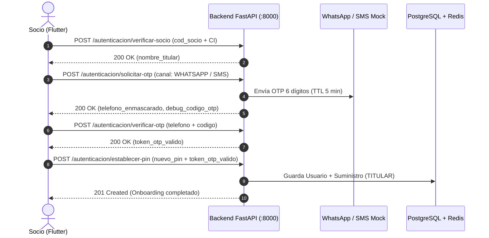

# Guía de Integración Backend para Desarrollador Frontend (Flutter)
> **Proyecto:** App Móvil y Web de Socios COSMOL R.L.  
> **Módulo:** Identidad, Onboarding Dual OTP y Autenticación Multicuenta (Fase 1)  
> **Estado:** 100% Funcional, Probado y Listo para Consumo  
> **URL Base Local:** `http://localhost:8000/api/v1`  
> **Swagger UI Interactivo:** `http://localhost:8000/docs`  
> **ReDoc:** `http://localhost:8000/redoc`  

---

## 1. Conexión de Red para Pruebas (Mobile / Web)

| Plataforma | URL Base | Configuración requerida |
|---|---|---|
| **Móvil Físico (USB)** | `http://localhost:8000/api/v1` | Ejecutar túnel: `adb reverse tcp:8000 tcp:8000` |
| **Android Emulator** | `http://10.0.2.2:8000/api/v1` | IP de loopback estándar del emulador Android |
| **Flutter Web** | `http://localhost:8000/api/v1` | CORS ya configurado para admitir todos los orígenes |

---

## 2. Cuentas de Prueba Certificadas (Sistema Comercial Real COSMOL)

El backend opera conectado en vivo al servidor de COSMOL R.L. sin datos simulados. Para probar el Onboarding y autenticación, utilizar cualquiera de los siguientes socios reales validados:

| Código Socio (`cod_socio`) | Carnet (`ci`) | Titular Oficial en COSMOL | Estado / Notas |
|---|---|---|---|
| **`23807`** | `6259185` | MISERICORDIA AGUANTA EDDY FRANCO | Al día (12 periodos de historial) |
| **`556`** | `4638847` | SUAREZ BALTAZAR VICTOR HUGO, CAROLINA | Al día |
| **`540`** | `4638847` | SUAREZ BALTAZAR VICTOR HUGO | Con deuda (2 facturas impagas para probar alertas) |
| **`1001`** | `6312456` | Socio Montero | Al día |

> **Nota para desarrollo:** Para cualquier otro socio real de Montero que posea factura física, se puede realizar el onboarding ingresando su código de socio y el número de CI/NIT impreso en su aviso.

---

## 3. Flujo 1: Primer Acceso / Onboarding (Saneamiento de Celular)

Este flujo se ejecuta **una sola vez por socio** para registrar su teléfono verificado y crear su PIN personal.



### Paso 1: Verificar Socio
* **Endpoint:** `POST /api/v1/autenticacion/verificar-socio`
* **Body:**
  ```json
  {
    "cod_socio": "104523",
    "ci": "8392019"
  }
  ```
* **Respuesta Exitosa (`200 OK`):**
  ```json
  {
    "cod_socio": "104523",
    "nombre_titular": "CARLOS EDUARDO PEREZ",
    "mensaje": "Socio verificado correctamente. Proceda a asociar su teléfono celular."
  }
  ```

### Paso 2: Solicitar OTP Dual
* **Endpoint:** `POST /api/v1/autenticacion/solicitar-otp`
* **Body:**
  ```json
  {
    "cod_socio": "104523",
    "telefono": "71029384",
    "canal": "WHATSAPP"
  }
  ```
  *(Nota: `telefono` acepta formato local de 8 dígitos `71029384` o internacional `+59171029384`). `canal` acepta `"WHATSAPP"` o `"SMS"`.*
* **Respuesta Exitosa (`200 OK`):**
  ```json
  {
    "mensaje": "Código de seguridad enviado exitosamente vía WHATSAPP.",
    "canal": "WHATSAPP",
    "telefono_enmascarado": "+591 7***9384",
    "ttl_segundos": 300,
    "debug_codigo_otp": "849201"
  }
  ```
  > **Nota de desarrollo:** En entorno `development`, el campo `debug_codigo_otp` contiene el código generado para facilitar pruebas en Flutter sin necesidad de ver los logs de Docker. En producción este campo es `null`.

### Paso 3: Verificar Código OTP
* **Endpoint:** `POST /api/v1/autenticacion/verificar-otp`
* **Body:**
  ```json
  {
    "telefono": "+59171029384",
    "codigo": "849201"
  }
  ```
* **Respuesta Exitosa (`200 OK`):**
  ```json
  {
    "mensaje": "Número de teléfono verificado exitosamente. Proceda a crear su PIN personal.",
    "token_otp_valido": "kJ829sLw...",
    "cod_socio": "104523"
  }
  ```

### Paso 4: Establecer PIN y Crear Cuenta
* **Endpoint:** `POST /api/v1/autenticacion/establecer-pin`
* **Body:**
  ```json
  {
    "telefono": "+59171029384",
    "token_otp_valido": "kJ829sLw...",
    "nuevo_pin": "4455"
  }
  ```
* **Respuesta Exitosa (`201 Created`):**
  ```json
  {
    "mensaje": "¡Registro completado exitosamente! Ahora puede iniciar sesión con su Código de Socio y su PIN personal.",
    "cod_socio": "104523"
  }
  ```
  *A partir de este instante, la CI queda invalidada como contraseña para siempre.*

---

## 4. Flujo 2: Login Diario Habitual

Una vez completado el Onboarding, el socio inicia sesión diariamente con su Código de Socio y su PIN personal (o Biometría de Flutter).

* **Endpoint:** `POST /api/v1/autenticacion/login`
* **Body:**
  ```json
  {
    "cod_socio": "104523",
    "pin_password": "4455",
    "device_id": "hw-unique-uuid-del-dispositivo",
    "modelo_dispositivo": "Samsung Galaxy A54"
  }
  ```
* **Respuesta Exitosa (`200 OK`):**
  ```json
  {
    "access_token": "eyJhbGciOiJIUzI1NiIs...",
    "refresh_token": "eyJhbGciOiJIUzI1NiIs...",
    "token_type": "bearer",
    "suministros": [
      {
        "id": "550e8400-e29b-41d4-a716-446655440000",
        "cod_socio": "104523",
        "alias": "Mi Casa",
        "rol": "TITULAR",
        "es_suministro_principal": true
      }
    ]
  }
  ```

---

## 5. Flujo 3: Renovación Silenciosa de Token (Refresh Token)

Permite refrescar el `access_token` en segundo plano sin pedir de nuevo las credenciales.

* **Endpoint:** `POST /api/v1/autenticacion/renovar-token`
* **Body:**
  ```json
  {
    "refresh_token": "eyJhbGciOiJIUzI1NiIs...",
    "device_id": "hw-unique-uuid-del-dispositivo"
  }
  ```
* **Respuesta Exitosa (`200 OK`):**
  ```json
  {
    "access_token": "eyJhbGciOiJIUzI1NiIs...",
    "refresh_token": "eyJhbGciOiJIUzI1NiIs...",
    "token_type": "bearer",
    "suministros": []
  }
  ```

---

## 6. Flujo 4: Gestión Multicuenta (Suministros)

Todos estos endpoints requieren enviar la cabecera HTTP:
```http
Authorization: Bearer <access_token>
```

### 6.1 Listar Suministros del Socio
Alimentar el selector desplegable / carrusel del Dashboard principal.
* **Endpoint:** `GET /api/v1/autenticacion/suministros`
* **Cabecera:** `Authorization: Bearer <access_token>`
* **Respuesta Exitosa (`200 OK`):**
  ```json
  [
    {
      "id": "550e8400-e29b-41d4-a716-446655440000",
      "cod_socio": "104523",
      "alias": "Mi Casa",
      "rol": "TITULAR",
      "es_suministro_principal": true
    },
    {
      "id": "789e8400-e29b-41d4-a716-446655440001",
      "cod_socio": "205566",
      "alias": "Alquiler Bolívar",
      "rol": "CONSULTA_PAGO",
      "es_suministro_principal": false
    }
  ]
  ```

### 6.2 Vincular Nuevo Suministro (Titular vs Inquilino)
* **Endpoint:** `POST /api/v1/autenticacion/suministros/vincular`
* **Cabecera:** `Authorization: Bearer <access_token>`
* **Body Modo TITULAR (Requiere CI o Medidor del titular):**
  ```json
  {
    "cod_socio": "205566",
    "ci_o_medidor": "4920192",
    "alias": "Alquiler Bolívar"
  }
  ```
* **Body Modo CONSULTA_PAGO (Inquilino / Pagador externo, sin datos sensibles):**
  ```json
  {
    "cod_socio": "301144",
    "alias": "Departamento Alquiler"
  }
  ```
* **Respuesta Exitosa (`201 Created`):** Retorna el objeto `SuministroResponse` creado.

---

## 7. Códigos de Error y Manejo de Seguridad en Frontend

Todas las respuestas de error del backend siguen el formato estándar:
```json
{
  "success": false,
  "error": {
    "code": "ACCOUNT_LOCKED",
    "message": "Ha alcanzado 3 intentos fallidos consecutivos. Su cuenta ha sido bloqueada temporalmente por 1 minuto(s).",
    "details": {
      "bloqueado_segundos_restantes": 60
    }
  }
}
```

### Tabla de Códigos de Error Críticos para Flutter

| Código de Error | HTTP Status | Acción recomendada en Flutter |
|---|---|---|
| `ACCOUNT_LOCKED` | `403 Forbidden` | Mostrar pantalla modal de cuenta bloqueada con temporizador regressivo usando `details.bloqueado_segundos_restantes`. Ofrecer botón de desbloqueo vía OTP. |
| `SESSION_REVOKED_NEW_DEVICE` | `401 Unauthorized` | Cerrar sesión local inmediatamente y alertar: *"Se inició sesión en otro dispositivo. Su sesión en este equipo fue revocada."* (Estilo WhatsApp). |
| `ONBOARDING_REQUIRED` | `401 Unauthorized` | Redirigir al usuario al flujo de Primer Acceso (paso 1). |
| `OTP_RATE_LIMIT_EXCEEDED` | `403 Forbidden` | Informar al socio que ha superado 3 solicitudes de OTP por hora y debe esperar antes de reintentar. |
| `OTP_INVALID` | `400 Bad Request` | Notificar código erróneo e indicar número de intento (al 3er fallo el código se quema). |
| `OTP_MAX_ATTEMPTS` | `403 Forbidden` | Informar que el código fue invalidado por seguridad y solicitar uno nuevo. |
| `SUMINISTRO_ALREADY_LINKED` | `400 Bad Request` | Notificar que ese contrato ya está en su lista multicuenta. |
| `SUPPLY_ACCESS_DENIED` | `403 Forbidden` | El usuario intentó consultar la deuda de un suministro ajeno que no tiene vinculado a su cuenta. |
| `SUPPLY_NOT_FOUND` | `404 Not Found` | El código de socio no existe en el sistema comercial de COSMOL. |

---

## 8. Flujo 5: Consulta de Deuda y Dashboard Principal (Fase 2)

> **Prefijo de Endpoints:** `/api/v1/deuda`  
> **Autenticación requerida:** `Authorization: Bearer <access_token>`

### 8.1 Suministros Pre-cargados para Pruebas de Deuda
Para validar los estados del Dashboard en Flutter, se dispone de las siguientes cuentas de prueba:

| Código de Socio | Estado de Deuda | Saldo Total | Facturas Pendientes | Alerta de Corte |
|---|---|---|---|---|
| **`556`** | **Al día** | `0.00 Bs` | 0 avisos | `false` (Semáforo verde) |
| **`540`** | **En mora** | `132.34 Bs` | 2 avisos (Agosto y Septiembre) | `true` (Semáforo rojo, riesgo de corte) |

---

### 8.2 Consulta de Deuda de un Suministro Específico
* **Endpoint:** `GET /api/v1/deuda/{cod_socio}`
* **Query Parameters:**
  * `forzar_refresco: bool` (opcional, default `false`): Si es `true`, ignora la caché de Redis y consulta en vivo al sistema comercial legado (ideal para la acción *Pull-to-Refresh* de Flutter).
* **Cabecera:** `Authorization: Bearer <access_token>`

#### Respuesta Exitosa (`200 OK`) — Ejemplo Modo TITULAR:
```json
{
  "cod_socio": "540",
  "suministro": {
    "cod_socio": "540",
    "nombre_titular": "DURAN ELOISA RIVERA DE",
    "ci_nit": "2823231",
    "direccion": "SANTA CRUZ 117",
    "ubicacion": "1.39.135.0",
    "categoria": "DOMESTICA",
    "rol_usuario": "TITULAR"
  },
  "moneda": "Bs",
  "saldo_pendiente_bs": 132.34,
  "cantidad_facturas_pendientes": 2,
  "fecha_proximo_vencimiento": "2026-09-30",
  "esta_vencido": true,
  "alerta_corte": true,
  "mensaje_alerta": "Posee 2 facturas pendientes. Evite el corte del servicio cancelando a la brevedad.",
  "facturas_pendientes": [
    {
      "nro_facip": "1160026",
      "nro_factura": "7444051",
      "cod_autorizacion": "465C3D0702C232069B9F771B83440D4217AF35B442086180BD081BF74",
      "periodo": "08/2026",
      "mes_lectura": "Agosto 2026",
      "anio": 2026,
      "mes": 8,
      "monto_bs": 70.92,
      "esta_vencida": true,
      "dias_mora": 17
    },
    {
      "nro_facip": "1189283",
      "nro_factura": "7473308",
      "cod_autorizacion": "465C3D0702C244BA722BB331A2F8F4742AA59857E45C98CCD2AE2BF74",
      "periodo": "09/2026",
      "mes_lectura": "Septiembre 2026",
      "anio": 2026,
      "mes": 9,
      "monto_bs": 61.42,
      "esta_vencida": false,
      "dias_mora": 0
    }
  ],
  "fecha_consulta": "2026-09-17T21:30:00Z",
  "origen_datos": "CACHE"
}
```

#### Respuesta con Enmascaramiento de Privacidad — Modo Inquilino (`CONSULTA_PAGO`):
Si el usuario consulta un suministro en el que fue vinculado como inquilino, el backend entrega automáticamente los campos ofuscados:
```json
{
  "suministro": {
    "cod_socio": "540",
    "nombre_titular": "D**** E**** R**** D****",
    "ci_nit": "***231",
    "direccion": "SANTA CRUZ ***",
    "ubicacion": "1.39.135.0",
    "categoria": "DOMESTICA",
    "rol_usuario": "CONSULTA_PAGO"
  }
}
```

#### Guía de Renderizado Visual para Flutter:
1. **Semaforización del Vencimiento (`esta_vencido == true`):**
   * Pintar la fecha límite y el indicador en color rojo oficial `#D32F2F`.
   * Si `esta_vencido == false`, pintar en color neutro o verde `#2E7D32`.
2. **Alerta de Corte Inminente (`alerta_corte == true`):**
   * Mostrar un banner superior o tarjeta de advertencia roja con icono de alerta (`Icons.warning_amber_rounded`): *"Aviso de corte inminente por 2 o más facturas impagas"*.
3. **Optimización de Caché:**
   * Las consultas con `origen_datos: "CACHE"` responden en `< 20 ms`. No bloquear la pantalla con spinners largos si ya se dispone de caché.

---

### 8.3 Resumen Consolidado para el Dashboard Multicuenta
Alimenta la pantalla de inicio cuando el socio administra varios predios (casa, negocio, familiares).

* **Endpoint:** `GET /api/v1/deuda/dashboard/resumen`
* **Cabecera:** `Authorization: Bearer <access_token>`

#### Respuesta Exitosa (`200 OK`):
```json
{
  "usuario_id": "3fa85f64-5717-4562-b3fc-2c963f66afa6",
  "deuda_total_consolidada_bs": 132.34,
  "cantidad_suministros": 2,
  "suministros": [
    {
      "cod_socio": "556",
      "saldo_pendiente_bs": 0.0,
      "esta_vencido": false,
      "alerta_corte": false,
      "facturas_pendientes": []
    },
    {
      "cod_socio": "540",
      "saldo_pendiente_bs": 132.34,
      "esta_vencido": true,
      "alerta_corte": true,
      "facturas_pendientes": ["..."]
    }
  ]
}
```

---

### 8.4 Invalidar Caché de Deuda (Post-Pago o Actualización)
* **Endpoint:** `POST /api/v1/deuda/{cod_socio}/invalidar-cache`
* **Cabecera:** `Authorization: Bearer <access_token>`
* **Respuesta Exitosa (`200 OK`):**
```json
{
  "cod_socio": "540",
  "cache_invalidada": true,
  "mensaje": "Caché de deuda para el suministro '540' invalidada exitosamente."
}
```

---

## 9. Módulo de Documentos y Facturas Digitales en PDF (Fase 3)

Permite consultar el historial de documentos y descargar archivos PDF generados on-demand o recuperados desde el almacenamiento de objetos MinIO S3 (`cosmol-docs`).

### 9.1 Listar Documentos de un Suministro por Pestañas
* **Endpoint:** `GET /api/v1/documentos/{cod_socio}`
* **Parámetros Query (Opcionales):**
  * `tipo`: Filtrar por categoría (`FACTURA`, `AVISO_COBRANZA`, `AVISO_CORTE`).
* **Cabecera:** `Authorization: Bearer <access_token>`

#### Respuesta Exitosa (`200 OK`) — Perfil TITULAR:
```json
{
  "cod_socio": "540",
  "rol_acceso": "TITULAR",
  "total_documentos": 3,
  "facturas": [
    {
      "id": "e8499bf2-72c6-43bf-895c-19602e1bdfc0",
      "cod_socio": "540",
      "tipo_documento": "FACTURA",
      "nro_factura": "7444051",
      "nro_facip": null,
      "cod_autorizacion": "465C3D0702C232069B9F771B83440D4217AF35B442086180BD081BF74",
      "periodo": "08/2026",
      "anio": 2026,
      "mes": 8,
      "monto_bs": 70.92,
      "fecha_emision": "2026-09-18",
      "fecha_vencimiento": null,
      "estado_pago": "PENDIENTE",
      "s3_key": "facturas/540/08_2026_7444051.pdf",
      "permite_descarga": true,
      "url_descarga": "/api/v1/documentos/e8499bf2-72c6-43bf-895c-19602e1bdfc0/descargar"
    }
  ],
  "avisos_cobranza": [
    {
      "id": "b3e020fa-0e7d-41a3-9ea9-b2c32cf961d1",
      "cod_socio": "540",
      "tipo_documento": "AVISO_COBRANZA",
      "nro_factura": null,
      "nro_facip": "1160026",
      "cod_autorizacion": null,
      "periodo": "08/2026",
      "anio": 2026,
      "mes": 8,
      "monto_bs": 70.92,
      "fecha_emision": "2026-09-18",
      "fecha_vencimiento": null,
      "estado_pago": "PENDIENTE",
      "s3_key": "avisos_cobranza/540/08_2026_1160026.pdf",
      "permite_descarga": true,
      "url_descarga": "/api/v1/documentos/b3e020fa-0e7d-41a3-9ea9-b2c32cf961d1/descargar"
    }
  ],
  "avisos_corte": [
    {
      "id": "c1f7b11d-2b4a-4632-a56e-82199b538e12",
      "cod_socio": "540",
      "tipo_documento": "AVISO_CORTE",
      "nro_factura": null,
      "nro_facip": null,
      "cod_autorizacion": null,
      "periodo": "09/2026",
      "anio": 2026,
      "mes": 9,
      "monto_bs": 132.34,
      "fecha_emision": "2026-09-18",
      "fecha_vencimiento": null,
      "estado_pago": "PENDIENTE",
      "s3_key": "avisos_corte/540/09_2026_corte_inminente.pdf",
      "permite_descarga": true,
      "url_descarga": "/api/v1/documentos/c1f7b11d-2b4a-4632-a56e-82199b538e12/descargar"
    }
  ],
  "documentos": ["..."]
}
```

#### Respuesta Exitosa (`200 OK`) — Perfil Inquilino (`CONSULTA_PAGO`):
El backend oculta automáticamente las listas fiscales y sensibles:
```json
{
  "cod_socio": "540",
  "rol_acceso": "CONSULTA_PAGO",
  "total_documentos": 1,
  "facturas": [],
  "avisos_cobranza": [
    {
      "id": "b3e020fa-0e7d-41a3-9ea9-b2c32cf961d1",
      "cod_socio": "540",
      "tipo_documento": "AVISO_COBRANZA",
      "nro_facip": "1160026",
      "periodo": "08/2026",
      "monto_bs": 70.92,
      "permite_descarga": true,
      "url_descarga": "/api/v1/documentos/b3e020fa-0e7d-41a3-9ea9-b2c32cf961d1/descargar"
    }
  ],
  "avisos_corte": [],
  "documentos": ["..."]
}
```

---

### 9.2 Descargar Archivo PDF por Streaming
* **Endpoint:** `GET /api/v1/documentos/{doc_id}/descargar`
* **Cabecera requerida:** `Authorization: Bearer <access_token>`
* **Cabeceras de Respuesta HTTP:**
  * `Content-Type: application/pdf`
  * `Content-Disposition: attachment; filename="Factura_Oficial_COSMOL_540_08-2026.pdf"`
* **Cuerpo de Respuesta:** Flujo binario con el archivo PDF compilado.

#### Respuestas de Error:
* **`403 Forbidden` (`DOCUMENT_ACCESS_DENIED`):**
  Ocurre si un usuario con rol `CONSULTA_PAGO` intenta descargar una factura fiscal o un aviso de corte:
  ```json
  {
    "success": false,
    "error": {
      "code": "DOCUMENT_ACCESS_DENIED",
      "message": "Acceso denegado: solo el titular registrado puede descargar facturas fiscales y avisos de corte.",
      "details": null
    }
  }
  ```
* **`403 Forbidden` (`SUMINISTRO_ACCESS_DENIED`):**
  Ocurre si el documento pertenece a un suministro que el usuario no tiene en su cartera.
* **`404 Not Found` (`DOCUMENT_NOT_FOUND`):**
  Ocurre si el `doc_id` especificado no existe en la base de datos.

---

### 9.3 Recomendación de Implementación en Flutter

1. **Diseño de Pestañas (`TabBar`):**
   * Configurar un `TabBar` con 3 pestañas: **Facturas**, **Avisos de Cobranza**, **Avisos de Corte**.
   * Si `rol_acceso == "CONSULTA_PAGO"`, ocultar o deshabilitar las pestañas de *Facturas* y *Avisos de Corte*, mostrando únicamente *Avisos de Cobranza* con un badge informativo: *"Vista de Inquilino: solo avisos de cobranza disponibles para pago"*.
2. **Descarga y Visualización:**
   * Utilizar `Dio` con `responseType: ResponseType.bytes`.
   * Almacenar temporalmente el buffer de bytes en `getApplicationDocumentsDirectory()` (`path_provider`).
   * Abrir el archivo de inmediato con `open_filex` o integrarlo en pantalla con `flutter_pdfview`.
   * Proveer botón de *"Compartir"* mediante el plugin `share_plus` para enviar el aviso de cobranza por WhatsApp.

