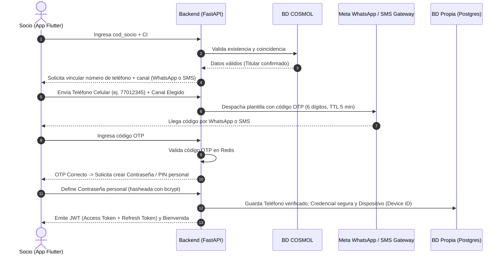

# Propuesta de Arquitectura: Autenticación, OTP y Gestión Multicuenta
# PRPUESTA INTEGRADA AL ARCHIVO AGENTS.MD COMO PRINCIPAL IDEA A IMPLEMENTAR 
> **Proyecto:** Plataforma Web y Móvil para Asociados de COSMOL R.L.  
> **Fecha:** Septiembre 2026  
> **Documento complementario a:** `AGENTS.md`

---

## 1. Contexto y Problemática

En el sistema comercial existente de **COSMOL R.L.** se cuenta con los identificadores tradicionales del socio:
- **Código de Socio (`cod_socio`)**
- **Carnet de Identidad / NIT (`CI / NIT`)**

### La Brecha de Confidencialidad
El documento de requerimientos preliminares planteaba el ingreso directo con `Código de Socio + CI como contraseña`. Sin embargo, esto presenta una vulnerabilidad crítica:
1. **Datos expuestos en avisos físicos:** Tanto el código de socio como el CI pueden ser visibles en facturas de papel, avisos de cobranza o preavisos de corte dejados en las puertas de los domicilios en Montero.
2. **Ausencia de teléfonos validados:** La base de datos legada no cuenta con números telefónicos consolidados ni verificados para la totalidad de los socios.
3. **Riesgo de suplantación y privacidad:** Cualquier vecino, inquilino o persona ajena que tenga acceso a una factura física podría ingresar al perfil del socio y ver datos personales, montos facturados, historial de consumo y reclamos.

### Objetivo de esta Solución
1. Permitir el **primer acceso** con los datos que el socio ya conoce (`cod_socio` + `CI`).
2. Utilizar ese primer acceso para **capturar y verificar el número de teléfono celular** del socio mediante un código de un solo uso (**OTP**).
3. Dar al usuario la **libertad de elegir el canal de recepción del OTP** (WhatsApp o SMS).
4. Blindar la cuenta solicitando la creación de una **contraseña/PIN privado** para que terceros con la factura en mano no puedan volver a acceder.
5. Permitir la **gestión de múltiples códigos de socio** bajo un mismo usuario (para personas con varios medidores, inquilinos o administración de cuentas familiares).

---

## 2. Canales de Entrega del Código OTP (Elección del Usuario)

En las pantallas donde se requiera enviar un código de verificación (primer registro, cambio de celular o recuperación de contraseña), la app mostrará un selector para que el socio elija su canal preferido:

```
Elige cómo deseas recibir tu código de seguridad:
(•) WhatsApp al +591 7XXXXXXX   [Recomendado - Instantáneo]
( ) Mensaje de Texto (SMS) al +591 7XXXXXXX
```

### Comparativa Técnica y de Costos

| Parámetro | Canal WhatsApp (Cloud API) | Canal Mensaje de Texto (SMS) |
|---|---|---|
| **Infraestructura** | Reutiliza la misma línea telefónica y WABA ya registrada en el Chatbot de COSMOL. | Pasarela de SMS (vía proveedor boliviano o pasarelas tipo Twilio/Sinch). |
| **Tiempo de entrega** | 1 a 3 segundos (alta tasa de entrega con datos o WiFi). | 5 a 60 segundos (depende de cobertura de red y operadora Entel/Tigo/Viva). |
| **Costo por entrega** | ~$0.025 - $0.035 USD (~0.17 a 0.25 Bs) por ventana de 24h (Categoría *Authentication*). | ~$0.045 - $0.080 USD (~0.31 a 0.55 Bs) por mensaje SMS entregado. |
| **Experiencia de usuario** | Mensaje oficial con logo verificado de COSMOL y botón directo *"Copiar código"*. | Mensaje de texto estándar en la app nativa de SMS del teléfono. |
| **Ventaja principal** | Más económico, no genera saturación de chip, entrega garantizada en smartphones. | Funciona incluso si el socio no tiene megas activos ni conexión a WhatsApp en ese momento. |

> **Nota:** La integración con WhatsApp Cloud API **no interfiere con el Chatbot actual de reportes y reclamos**. Una misma cuenta de WhatsApp Business puede recibir mensajes para el bot y, en paralelo, despachar plantillas de autenticación emitidas por el backend FastAPI.

---

## 3. Ciclo de Vida de la Autenticación

### Fase 1: Primer Acceso y Onboarding (Saneamiento de Datos)

Este flujo se ejecuta una única vez por cada socio:



**Resultado de la Fase 1:**
- El número de teléfono queda **registrado y verificado** en la base de datos.
- La contraseña del socio ya **no es su CI**. A partir de este momento, cualquier tercero que intente entrar con `cod_socio + CI` será rechazado, protegiendo la confidencialidad.

---

### Fase 2: Login Diario (Uso Habitual)

1. **Ingreso:** El socio ingresa con su `Código de Socio` + su `Contraseña / PIN personal`.
2. **Biometría Opcional (Flutter `local_auth`):** Una vez autenticado, la app le ofrece activar inicio de sesión con **Huella dactilar o Reconocimiento Facial**, permitiendo un acceso en 1 segundo sin tipear contraseñas.
3. **Sin Costo de Mensajería:** En los ingresos normales del día a día **no se envían códigos OTP**, por lo que no se generan costos recurrentes de WhatsApp ni de SMS.

---

### Fase 3: Recuperación de Contraseña y Cambio de Celular

#### A. Si el socio olvidó su contraseña:
1. Pulsa *"¿Olvidaste tu contraseña?"* en la pantalla de login.
2. Ingresa su `cod_socio`.
3. El sistema muestra el número registrado enmascarado (ej: `+591 7***2345`) y le pregunta:
   - *"¿Dónde deseas recibir tu código de recuperación? [ ] WhatsApp  [ ] SMS"*.
4. Se despacha el OTP al canal seleccionado.
5. Al verificar el código, se le permite ingresar una nueva contraseña.

#### B. Si el socio cambia de teléfono (Modelo estilo WhatsApp):
1. Instala la app en su nuevo smartphone e inicia sesión con su contraseña.
2. Si olvidó la contraseña o el sistema detecta un nuevo `Device ID`, solicita verificación OTP al número ya vinculado.
3. Al ingresar exitosamente en el nuevo teléfono, el backend **invalida los tokens de la sesión anterior**, cerrando automáticamente la sesión en el dispositivo antiguo.

---

## 4. Gestión Multicuenta (Múltiples Códigos de Socio)

Un problema común en cooperativas de servicios es la disociación entre la **persona** y los **medidores/contratos**:
- Un socio puede ser dueño de 3 inmuebles (su casa, un lote y un local comercial).
- Un inquilino necesita ver y pagar el agua del inmueble donde alquila, pero el titular es otra persona.
- Un hijo gestiona el pago de los servicios de sus padres adultos mayores.

### La Solución Arquitectónica: 1 Perfil Digital = N Códigos de Socio

No se debe obligar al usuario a "cerrar sesión y volver a entrar" para consultar otro medidor. La app centraliza los suministros en un solo perfil:

```
                 ┌───────────────────────────────────────┐
                 │        Perfil Digital Usuario         │
                 │     (Teléfono Verificado + PIN)       │
                 └──────────────────┬────────────────────┘
                                    │
       ┌────────────────────────────┼────────────────────────────┐
       ▼                            ▼                            ▼
┌──────────────┐             ┌──────────────┐             ┌──────────────┐
│  Cod: 10245  │             │  Cod: 28410  │             │  Cod: 05891  │
│ "Mi Casa"    │             │ "Local Cntr" │             │ "Casa Papás" │
│ (Rol Titular)│             │ (Rol Titular)│             │(Rol Consulta)│
└──────────────┘             └──────────────┘             └──────────────┘
```

### Tipos de Vinculación por Código de Socio

1. **Vinculación Modo Titular (Propietario):**
   - **Requisitos:** Requiere ingresar el `cod_socio` y validar el `CI / NIT` del titular (o un dato de control como el número de medidor).
   - **Alcance:** Acceso completo a facturas oficiales con valor legal (PDF), historial de lecturas/consumo analítico, avisos de corte, y gestión de trámites.

2. **Vinculación Modo Consulta y Pago (Inquilinos / Familiares):**
   - **Requisitos:** Solo requiere el `cod_socio` (o escanear el código de barras/QR de una factura física).
   - **Alcance:** Visualización del saldo adeudado, fecha de vencimiento y botón de pago con QR / pasarela externa.
   - **Privacidad:** **Oculta datos sensibles**. No muestra el CI del dueño, ni el historial confidencial de reclamos, garantizando la privacidad del propietario.

### Experiencia de Usuario en la App (Flutter)
- En la parte superior del Dashboard se ubica un **Selector de Cuentas / Medidores**:
  - Permite alternar entre suministros con un solo toque.
  - El socio puede asignar **alias personalizados** a cada suministro (*"Mi Casa"*, *"Taller Mecánico"*, *"Casa Mamá"*).
  - Un botón visible: `[ + Agregar otro Código de Socio ]`.

---

## 5. Medidas de Seguridad y Políticas de Bloqueo (Alineadas a `AGENTS.md`)

Para proteger la plataforma contra ataques de fuerza bruta y fraudes:

1. **Límites en el envío de OTP:**
   - Máximo **3 solicitudes de OTP por hora** por número de teléfono, para evitar spam y costos innecesarios en WhatsApp o SMS.
   - El código tiene una validez estricta de **5 minutos** y expira automáticamente en Redis.
2. **Bloqueo por Intentos Fallidos de Login:**
   - Rate limiting por IP en el backend (FastAPI + SlowAPI) para mitigar ataques masivos.
   - Tras **3 a 5 intentos fallidos** consecutivos con contraseña incorrecta, la cuenta entra en bloqueo progresivo temporal (1 min → 5 min → 15 min → 1 hora).
   - El desbloqueo inmediato solo es posible completando el flujo de recuperación vía OTP (WhatsApp o SMS).
3. **Auditoría hacia `ChatbotReportes`:**
   - Cada evento de seguridad (registro exitoso, intento fallido de login, envío de OTP, bloqueo de cuenta) despacha un evento en segundo plano (`BackgroundTasks`) hacia la base de datos de auditoría del proyecto `ChatbotReportes`, permitiendo monitorear anomalías desde el sistema central de COSMOL.

---

## 6. Resumen de Decisiones Listas para Validación

| Aspecto | Propuesta Final |
|---|---|
| **Credencial de primer acceso** | `cod_socio` + `CI` (según requerimientos oficiales de COSMOL). |
| **Factor de protección posterior** | Teléfono validado con OTP + Creación de Contraseña/PIN propio. |
| **Canales de OTP disponibles** | **WhatsApp Cloud API** (canal principal/económico) y **SMS** (canal alternativo seleccionable). |
| **Reutilización de API WhatsApp** | Se usa el mismo número y cuenta de Meta del Chatbot actual de COSMOL sin conflicto. |
| **Múltiples medidores** | Soporte multicuenta nativo: 1 usuario puede enlazar varios `cod_socio` con roles diferenciados (Titular vs. Consulta de Pago). |
| **Login diario** | `cod_socio` + Contraseña/PIN o Biometría (Huella/Face ID) sin costo de mensajes. |
